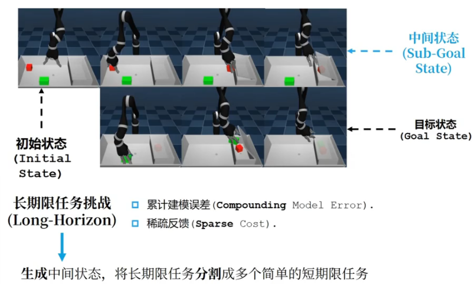

# Introduction to RL

## 1 面向决策的人工智能

人工智能任务大致可以分为预测型任务和决策型任务，后者是强化学习的研究范畴。

**静态环境/动态环境：** 环境是否随智能体决策而改变
**白盒环境/黑盒环境：** 变量与目标之间的关系是否能解析表示，黑盒环境中往往有某种混沌存在

强化学习专长于解决**序贯决策**问题，即智能体按顺序做出决策，并依次取得新的观测，直到任务结束的过程。

## 2 强化学习的定义与独特性

### 2.1 交互学习的特征

通过从交互中学习来实现目标的计算方法。

强化学习有以下三个要素：

- 感知：在某种程度上感知环境的状态
- 动作：可以采取动作类影响状态或达到目标
- 目标：随时间推移最大化累积奖励

*：可见强化学习的决策是在离散时间上进行的

### 2.2 强化学习中的数据

有监督学习任务建立在从给定的数据分布中采样得到的训练数据集上，通过优化在训练数据集中设定的目标函数（如最小化预测误差）寻找模型的最优参数，**数据集背后的数据分布是完全不变的**。

在强化学习中，数据是在智能体与环境交互的过程中得到。如果智能体不采取某个决策动作，那么该动作对应的数据就永远无法被观测到，所以当前智能体的训练数据和来自之前智能体的决策结果，**策略不同，产生的数据分布就不同**。

强化学习中的数据分布以*占用度量*(occupancy measure) $\rho^\pi(s,a)$ 表示，归一化的占用度量用于衡量在一个智能体决策与一个动态环境的交互过程中，采样到一个具体的状态动作对 $(s,a)$ 的概率分布。

占用度量的性质是，给定两个策略及其与一个动态环境交互得到的两个占用度量，那么当且仅当这两个占用度量相同时，这两个策略相同。

因此，由于强化学习训练过程中策略会不断发生改变，其对应的数据分布或占用度量也会随之发生改变。而由于奖励建立在状态动作对的基础上，**寻找最优策略对应着寻找最优占用度量**。

### 2.3 强化学习的训练目标

对于经典的有监督学习任务，我们的目标是找到一个最优的模型函数，使其在训练数据集上最小化一个给定的损失函数。在训练数据独立同分布的假设下，这个优化目标表示最小化模型在整个数据分布上的泛化误差：
$$model^*=arg\min_{model}\mathbb{E}_{(x,y)\sim p_{data}[\mathcal{L}(x,model(x))]}$$

相比之下，强化学习任务的最终优化目标是最大化智能体策略在和动态环境交互过程中的价值，或者奖励函数在占用度量上的期望：
$$model^*=arg\min_{\pi}\mathbb{E}_{(s,a)\sim \rho^\pi[\mathcal{R}(s,a)]}$$

二者相比，监督学习直接通过优化模型对于数据特征的输出来优化目标，即**修改目标函数而数据分布不变**；而强化学习旨在通过该百年策略来调整智能体与环境交互数据的分布，进而优化目标，即**修改数据分布而目标函数不变**。

## 3 强化学习的系统要素

### 3.1 历史（History）

观察、动作和奖励的序列，即一直到时间t为止的所有可观测变量，智能体的决策依据历史进行：
$$H_{t}=O_{1},R_{1},A_{1},O_{2},R_{2},A_{2},\dotsb,O_{t},R_{t},A_{t}$$

### 3.2 状态（State）

是一种用于确定接下来会发生的事情（动作、观察、奖励）的信息，是关于历史的函数：
$$S_{t}=f(H_{t})$$

### 3.3 策略（Policy）

是智能体在特定时间的行为方式，是从状态到动作的映射:

- 确定性策略：
  $$a=\pi(s)$$

- 随机策略：
  $$\pi(a|s)=P(A_t=a|S_t=s)$$

### 3.4 奖励（Reward）

是定义强化学习目标的**标量**：
$$R_t=r(s,a)$$

强化学习的学习目标是智能体在和环境持续交互过程中积累的累计奖励的期望最大化。
$$\max_{\pi}\mathbb{E}_{\pi,Env}[R_0+\gamma R_1+\gamma^2R_2+\dotsb]=\max_{\pi}\mathbb{E}_{\pi,Env}\left[\sum_{t=0}^T\gamma^tr(s_t,a_t)\right],\gamma\in[0,1]$$

*：其中$\gamma$表示衰减因子或折扣因子

### 3.5 模型（Model）

环境的模型用于模拟环境的行为

- 预测下一个状态：
  $$\mathcal{P}_{ss'}^{a}=\mathbb{P}[S_{t+1}=s'|S_t=s,A_t=a]$$
- 预测下一个（即时）奖励：
  $$\mathcal{R}_{s}^a=\mathbb{E}[R_{t+1}|S_t=s,A_t=a]$$ *:奖励可以具有随机性，但是通常取确定值。

## 4 动态规划

### 4.1 Bellman Equation

对于给定的策略 $\pi$ 价值函数定义为从某个状态和动作开始，获得的累计奖励期望：
$$\begin{aligned}
    Q_\pi(s,a) &=\mathbb{E}[r(s_0)+\gamma r(s_1)+\gamma^2 r(s_2)+\dotsb|s_0=s,a_0=a,\pi]\\&=r(s)+\gamma\sum_{s'\in S}P_{sa}(s')\sum_{a'\in A}\pi(a'|s')Q(s',a')
\end{aligned}$$

$P_{sa}$表示状态转移，此方程即*贝尔曼方程*（Bellman equation）。

### 4.2 Value Based Method

根据贝尔曼方程，一个直白的优化方式是直接优化使得 $Q_\pi(s,a)$ 最大化的 $\pi$:
$$\pi(s)=arg\max_a Q(s,a)$$

但是这种方式的弊端在于对于每次优化，需要穷举所有可能的行动，此外，由于 $Q$ 本身在优化过程中不一定是准确的，所以优化的结果也可能是不准确的。

### 4.3 Policy Based Method

基于策略的方式直接对策略的参数进行优化：
$$\theta^*=arg\max_\theta\mathbb{E}_{(s,a)\sim\rho^{\pi_\theta}}[r(s,a)]$$

但是对 $\rho^{\pi_\theta}$ 的建模是困难的，尤其是在变量连续的情况下。

当以参数化的模型代替表格时，我们就进入了深度强化学习的范畴。

## 5 Deep RL

### 5.1 深度强化学习的特征

- 利用深度神经网络进行价值函数和策略近似
- 端到端的强化学习算法
- 反向传播的优化方式
- 难以稳定训练
- 需要大量数据
- 相当高维的参数空间

### 5.2 强化学习前沿

- 基于模拟模型的强化学习：建立环境模拟器，在模拟器中训练强化学习策略
  
- 目标策动的强化学习
  
- 模仿学习：如何将强化学习应用于难以定义reward的场景（如无人驾驶）
- 多智能体强化学习
- 离线强化学习
- 强化学习决策大语言模型
