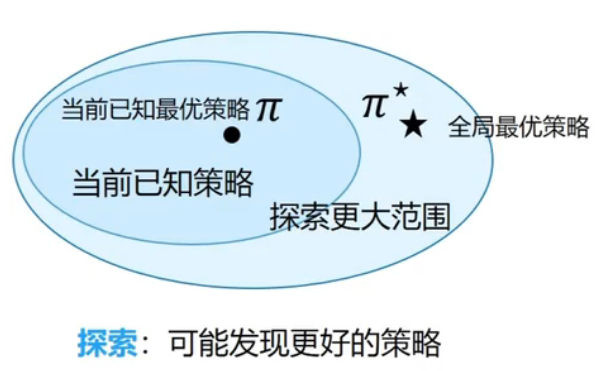

# Exploration and Exploitation

## 1 A Basic Problem in the area of Sequential Decision Task

序列决策任务中的一个关键问题是如何平衡好探索和利用：

- **利用（Exploitation）** 执行能够获得已知最优收益的决策
- **探索（Exploration）** 尝试执行更多的决策，不一定会获得最优收益

## 2 Some Principles of Policy Exploration

- 朴素方法（Maive Exploration）
  - 添加策略噪声（$\epsilon$-greedy）
- 积极初始化（Optimistic Initialization）
- 基于不确定性的位置（Uncertainty Measurement）
  - 尝试具有不确定收益的策略，可能带来更高的收益
- 概率匹配（Probility Matching）
  - 基于概率选择最优策略
- 状态搜索（State Searching）
  - 探索后续状态可能带来更高的收益

## 3 多臂老虎机（multi-armed bandit, MAB）

### 3.1 问题定义
多臂老虎机中是研究“探索和利用”问题的典型范式。

与强化学习不同，多臂老虎机不存在状态信息，只有动作和奖励。在多臂老虎机问题中，有一个具有 $K$ 根拉杆的老虎机，拉动每一根拉杆都对应一个关于奖励的概率分布 $\mathcal{R}$，每次拉动其中一根拉杆，就可以从该拉杆对应的奖励概率分布中获得一个奖励 $r$。智能体在各根拉杆对应的奖励概率分布未知的情况下，从头开始尝试，目标是在操作 $T$ 次拉杆之后获得尽可能高的累计奖励。

### 3.2 形式化描述

多臂老虎机问题可以形式化地表示为一个元组 $\langle \mathcal{A},\mathcal{R} \rangle$，其中：
- $\mathcal{A}$ 表示动作集合，对于具有 $K$ 根拉杆的老虎机，$\mathcal{A}=\{a_1,a_2,\dotsb,a_K \}$
- $\mathcal{R}$ 表示奖励概率分布，拉动每一根拉杆的动作 $a$ 都对应一个奖励概率分布 $\mathcal{R}(r|a)$
多臂老虎机任务的目标被表示为：
$$max\sum_{t=1}^Tr_t,r_t\sim\mathcal{R}(·|a_ta_t)$$

### 3.3 累积懊悔（cumulative regret）

对于每一个动作 $a$，定义其期望奖励为：
$$Q(a)=\mathbb{E}_{r \sim \mathcal{R}(·|a)}[r]$$

至少存在一跟拉杆，其期望奖励应当不少于拉动其他任意一根拉杆，定义最优期望奖励为：
$$Q*=\max_{a\in\mathcal{A}}Q(a)$$

懊悔描述了拉动一根拉杆的期望奖励与最优期望奖励之间的差距：
$$R(a)=Q*-Q(a)$$

累积懊悔即 $T$ 次拉动拉杆之后积累的懊悔总量，对于一次完整的 $T$ 步决策 $\{a_1,a_2,\dotsb,a_T \}$，累积懊悔表示为：
$$\sigma_R=\sum_{t=1}^TR(a_t)$$

MAB的目标等价于最小化累积懊悔:
$$\min\sigma_R=\max\mathbb{E}_{a\sim\pi}[\sum_{t=1}^TR(a_t^i)]$$

累积懊悔的下界通过使用$\Delta_a=Q^*-Q(a)$和反馈函数的分布相似性：$D_{KL}(\mathcal{R}(r|a)||\mathcal{R}^*(r|a))$描述：
$$\lim_{T\rightarrow\infty}\sigma_R\geq\log T\sum_{a|\Delta_a>0}\frac{\Delta_a}{D_{KL}(\mathcal{R}(r|a)||\mathcal{R}^*(r|a))}$$

这表示选择的拉杆与最优的拉杆的奖励分布之间的差距越小，区分二者的成本就越大。

### 3.4 奖励期望估计

通过多次拉动一根拉杆并求移动平均的方式可以对奖励期望进行估计：
$$\begin{aligned}
    Q_k &=\frac{1}{k}\sum_{i=1}^{k}r_i\\
        &=\frac{1}{k}\left[r_k + \sum_{i=1}^{k-1}r_i \right]\\
        &=\frac{1}{k}(r_k +(k-1)Q_{k-1})\\
        &=\frac{1}{k}(r_k +kQ_{k-1}-Q_{k-1})\\
        &=Q_{k-1}+\frac{1}{k}[r_k-Q_{k-1}]
\end{aligned}$$

使用增量更新的原因是时间、空间复杂度均可控制在 $O(1)$。

### 3.5 贪心策略

贪心策略总是选择拉动奖励期望估计最大的拉杆，其累积懊悔随动作次数线性增长。
$$Q(a^i)=\frac{1}{N(a^i)}\sum_{t=1}^{T}r_t$$

$$a^*=\arg \max_{a^i}Q(a^i)$$

$$\sigma_R\propto T·[Q(a^i)-Q^*]$$

### 3.6 $\epsilon$-greedy策略

$\epsilon$-greedy策略在完全贪婪策略的基础之上添加了噪声，每次以概率 $1-\epsilon$ 选择以往经验中期望奖励估值最大的拉杆，以概率 $\epsilon$ 选择一根随机拉杆。
$$a_t=\begin{cases}
    \arg \underset{a}{\max}\hat{Q}(a)&,p=1-\epsilon\\
    U(0,|\mathcal{A}|)&,p=\epsilon
\end{cases}$$

累积懊悔仍然呈线性增长，但是增长率减小。
$$\epsilon_R\geq\frac{\epsilon}{|\mathcal{A}|}\sum_{a\in{A}}\Delta_a$$

随时间步的增加，我们认为收集到的信息越来越完善，进行探索的倾向减少，因此使 $\epsilon$ 随时间衰减。
一种可能的衰减方式：
$$c\geq0, ~~~ d=\min_{a|\Delta_a>0}\Delta_a, ~~~ \epsilon_t=\min \left \{ 1,\frac{c|\mathcal{A}|}{d^2t} \right \}$$
在这种情况下可以实现累积懊悔的次线性增长。

### 3.7 乐观初始化

乐观初始化是一种纯利用策略，通过给所有 $Q(a^i)$ 较高的初始化值，并通过增量式地更新及贪婪式的选择进行优化。

- 对 $Q(a^i)$ 估计是有偏的，但是随采样增加，偏差会逐渐减小
- 仍然有可能陷入局部最优

### 3.9 上置信界算法（UCB）

UCB算法基于这样一种直觉，即不确定性越高的拉杆探索的价值越大。在此引入一种不确定性度量 $U(a)$，它随一个动作被尝试的次数的增加而减小，如何估计不确定性是UCB算法的核心问题。

**霍夫丁不等式（Hoeffding's inequality）** 霍夫丁不等式是一种用于估计不确定性上界的算法，令 $X_1,X_2,\dotsb,X_n$ 为n个独立同分布的随机变量，取值范围为 $[0,1]$，经验期望表示为 $\bar{X}=\frac{1}{n}\sum_{j=1}^nX_j$,则：
$$P(E[X]\geq\bar{x}_n+u)\leq e^{-2nu^2}$$

对于MAB问题，将奖励期望带入 $\bar{x}_i$，不等式中的参数 $u=\hat{U}(a_i)$代表不确定性度量。对于给定的概率 $p=e^{-2N(a_i)U(a_i)^2}$，$Q(a_i)<\hat{Q}(a_i)+\hat{U}(a_i)$ 成立的概率至少为 $1-p$。当 $p$ 很小时，认为 $\hat{Q}(a_i)+\hat{U}(a_i)$ 就是期望奖励上界。其中 $\hat{U}(a_i)=\sqrt{\frac{-\log p}{2N(a_i)}}$，因此，设定一个概率超参数 $p$ 之后就可以计算出与之对应的不确定性度量，进而确定期望奖励上界了。

直观地来说，UCB算法在每次选择拉杆前，先估计拉动每根拉杆的期望奖励上界，使得拉动每根拉杆的期望奖励只有很小的概率 $p$ 超过这个上界，接着选出期望奖励上界最大的拉杆，并通过增量法更新奖励期望估计。
$$a_i=\arg \max_{a\in\mathcal{A}}[\hat{Q}(a)+c·\hat{U}(a)]$$

$c$ 是一个用于控制不确定性比重的参数。

UCB算法中，累积懊悔亦呈次线性增长。

### 3.8 汤普森采样（Thompson Sampling）

汤普森采样假设拉动每根拉杆的奖励服从一个特定的概率分布（通常是Beta分布），在一组预期分布中采样，得到一组预期奖励样本，再拉动样本中奖励最大的拉杆，根据实际动作的结果对假想的概率分布进行更新。具体来说，若某拉杆被选择了 $k$ 次，其中 $m_1$ 次奖励为1，$m_2$ 次奖励为0，则假定这根拉杆服从 $(m_1+1, m_2+1)$ 的Beta分布。

汤普森采样的累积懊悔亦呈次线性增长。