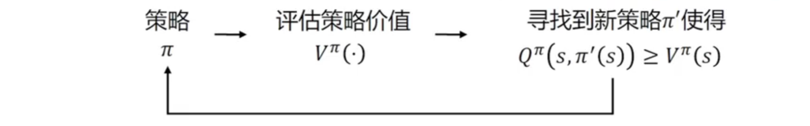

# Markov Decision Process

MDP 是对强化学习交互环境的数学刻画，而不是强化学习算法。

## 1 Markov Process

马尔可夫过程（Markov Process）是具有马尔可夫性质的随机过程。

状态 $S_t$ 是马尔可夫的，当且仅当：
$$\mathbb{P}[S_{t+1}|S_{t}]=\mathbb{P}[S_{t+1}|S_{t},S_{t-1},\dotsb,S_1]$$

马尔可夫过程有以下性质：

- 状态（State）从历史（History）中获取了所有相关信息
- 状态已知时，历史可以被抛弃
- 也就是说，**当前状态是未来的充分统计量**

通常使用一个二元组 $\langle\mathcal{S},\mathcal{P}\rangle$ 表示马尔可夫过程，其中：

- $\mathcal{S}$ 表示有限数量的状态集合
- $\mathcal{P}$ 表示*状态转移矩阵*（state transition matrix）

状态转移矩阵 $\mathcal{P}$ 定义了所有状态对之间的转移概率：
$$\begin{bmatrix}P(s_{1}|s_{1}) & P(s_{2}|s_{1}) & \cdots & P(s_{n}|s_{1}) \\
P(s_{1}|s_{2}) & P(s_{2}|s_{2}) & \cdots & P(s_{n}|s_{2})\\
\vdots &\vdots & \ddots & \vdots \\
P(s_{1}|s_{n}) & P(s_{2}|s_{n}) & \cdots & P(s_{n}|s_{n})
\end{bmatrix}$$

$\mathcal{P}$ 是一个行归一化的矩阵，因为从某一个状态出发，转移至其他状态的概率之和必须为1。

给定一个马尔可夫过程，我们就可以从某个状态出发，根据它的状态转移矩阵生成一个*状态序列*（episode），这个过程称为马尔可夫过程的*采样*（sampling）。

## 2 Markov Reward Process

在马尔可夫过程的基础上添加奖励函数和折扣因子，就可以得到马尔可夫奖励过程，以一个四元组 $\langle \mathcal{S},\{P_{sa}\},\gamma,r \rangle$ 表示。

奖励函数根据状态给予一定的奖励值，随即变量记为 $R_t$：
$$R_{t}=r(S_t)$$

基于状态序列及其对应的奖励，可以得到序列的回报：
$$G_t=R_t+\gamma R_{t-1}+\gamma^2 R_{t-2}+\dotsb=\sum^\infty_{k=0}\gamma^{k}R_{t+k}$$

**Q：** 为什么序列回报以该形式呈现？
**A：** 因为我们需要构建序列之间的全序，即对于任意两个序列需要有孰好孰坏之分。如果希望序列有全序，并满足：
$$[a_1,a_2,\dotsb]\prec[b_1,b_2,\dotsb]\iff[r,a_1,a_2,\dotsb]\prec[r,b_1,b_2,\dotsb]$$

那么序列回报只会是上述 $\gamma$ 衰减求和的形式。

在马尔可夫奖励过程中，一个状态的期望回报称为这个状态的*价值*（value），所有状态的价值组成*价值函数*（value function），价值函数的输入是某个状态，输出为这个状态的价值：
$$\begin{aligned}
    V(s)&=\mathbb{E}[G_t|S_t=s]\\
    &=\mathbb{E}[R_t+\gamma R_{t+1}+ \gamma^2 R_{t+2}+\dotsb|S_t=s]\\
    &=\mathbb{E}[R_t+\gamma (R_{t+1}+ \gamma R_{t+2}+\dotsb)|S_t=s]\\
    &=\mathbb{E}[R_t+\gamma G_{t+1}|S_t=s]\\
    &=\mathbb{E}[R_t+\gamma V(S_{t+1})|S_t=s]\\
    &=\mathbb{E}[R_t|S_t=s]+\mathbb{E}[\gamma V(S_{t+1})|S_t=s]\\
\end{aligned}$$

上式中，即时奖励的期望正是奖励函数的输出：
$$\mathbb{E}[R_t|S_t=s]=r(s)$$

剩余部分可以从转移概率中得到：
$$\mathbb{E}[\gamma V(S_{t+1})|S_t=s]=\gamma\sum_{s'\in S}P(s'|s)V(s')$$

合并两个部分，就可以得到：
$$V(s)=r(s)+\gamma\sum_{s'\in S}P(s'|s)V(s')$$

此即 MRP 中的*贝尔曼方程*（Bellman equation），可以写为矩阵形式：
$$\mathcal{V}=\mathcal{R}+\gamma \mathcal{P}\mathcal{V}$$

其中 $\mathcal{V}=[V(s_1),V(s_2),\dotsb]^T$，$\mathcal{R}=[r(s_1),r(s_2),\dotsb]^T$，根据矩阵运算可以求解：
$$\mathcal{V}=(\mathcal{I}-\gamma \mathcal{P})^{-1}\mathcal{R}$$

求解析解的时间复杂度是 $O(n^3)$，在求解较大规模的 MRP 的价值函数时，可以使用*动态规划*（dynamic programing）算法、*蒙特卡洛*（Monto Carlo method）算法、*时序差分*（temporal difference）算法等。

## 3 Markov Decision Process(MDP)

MDP 提供了一套在**结果部分随机、部分在决策者控制下**的决策过程建模的数学框架：
$$\begin{aligned}
    \mathbb{P}[S_{t+1}|S_{t}]&=\mathbb{P}[S_{t+1}|S_{t},S_{t-1},\dotsb,S_1]\\
    &=\mathbb{P}[S_{t+1}|S_{t},A_{t}]
\end{aligned}$$

其中 $A_{t}$ 表示智能体的决策。

MDP 完全形式化地描述了一种环境完全可观测，也即**当前状态可以完全表征过程**的强化学习环境。

MDP 可以由一个五元组表示 $\langle \mathcal{S},\mathcal{A},\{P_{sa}\},\gamma,r \rangle$，其中：

- $\mathcal{S}$ 是状态的集合
- $\mathcal{A}$ 是动作的集合
- $P_{sa}$ 是状态转移概率，有时写作 $P(·|s,a)$，为强化学习提供了动态性，这是强化学习和bandit的区别所在
- $\gamma \in [0,1]$ 是对未来奖励的折扣因子
- $r:\mathcal{S} \times \mathcal{A} \mapsto \mathbb{R}$ 是奖励函数

MDP 的动态过程包含以下几个环节：

- 从状态 $S_0$ 开始
- 智能体选择某个动作 $a_0 \in A$
- 智能体得到奖励 $r(s_0,a_0)$
- MDP 转移至下一个状态 $s_1 \sim P_{s_0a_0}$
- 以下过程将会持续进行，直到出现终止状态 $s_T$，或达到一定时间步，或永不终止
- 智能体的总回报为：
  $$r(s_0,a_0)+\gamma r(s_1,a_1)+\gamma^2 r(s_2,a_2)+\dotsb$$

类似于 MRP，以 $V^\pi(s)$ 表示为从状态 $s$ 出发遵循策略 $\pi$ 能得到的期望回报，称为基于策略 $\pi$ 的状态价值函数：
$$\begin{aligned}
    V^\pi(s)&=\mathbb{E}[r(s_0,A_0)+\gamma r(s_1,A_1)+\gamma^2 r(s_2,A_2)+\dotsb)|s_0,\pi]\\
    &=\mathbb{E}_\pi[G_t|S_t=s]
\end{aligned}$$

## 4 Occupancy Measure

给定同一个动态环境，不同的策略采样出的数据分布是不同的，以占用度量表示（occupancy measure）
$$\begin{aligned}
    \rho^\pi(s,a)&=\sum_{t=0}^{T}\gamma^tP(S_t=s,A_t=a|s_0,\pi)
\end{aligned}$$

有时会增加一个归一化因子 $1-\gamma$ 确保概率分布归一化。

定义状态占用度量：
$$\begin{aligned}
    \rho^\pi(s)&=\sum_{t=0}^{T}\gamma^t P(S_t=s|s_0,\pi)\\
    &=\sum_{a'}\rho^{\pi}(s,a')
\end{aligned}$$

占用度量有以下性质：

- 和同一动态环境交互的两个策略 $\pi_1$、$\pi_2$ 得到的占用度量 $\rho^{\pi_1}$、$\rho^{\pi_2}$ 满足：
  $$\rho^{\pi_1}=\rho^{\pi_2} \iff \pi_1=\pi_2$$

- 给定一个占用度量$\rho$，生成该占用度量的唯一策略是：
  $$\pi_\rho=\frac{\rho(s,a)}{\sum_{a'}\rho(s,a')}=\frac{\rho(s,a)}{\rho(s)}$$

策略学习的目标是**选择能够最大化累积奖励期望的动作**：
$$\begin{aligned}
    \max_\pi &\mathbb{E}[r(S_0.A_0)+\gamma r(S_1.A_1)+\gamma^2 r(S_2.A_2)+\dotsb|s_0,\pi]\\
    &=\sum_{s,a}\rho^\pi(s,a)r(s,a)
\end{aligned}$$

对上述目标的优化面临以下困难：

- 策略和占用度量之间的对应关系是黑盒的，因此上述优化目标没有直接对 $\pi$ 更新方向的指导
- 在每一个状态 $s$ 下，策略改变了动作的选择之后，如何确定策略整体是否被优化？

## 5 策略评估与策略提升

### 5.1 策略值函数估计

在给定环境和策略 $\pi$ 的情况下，策略值函数的估计如下：

- 状态价值：
  $$\begin{aligned}
    V^\pi(s)&=\mathbb{E}_\pi[r(S_0,A_0)+\gamma r(S_1,A_1)+\gamma^2 r(S_2,A_2)+\dotsb|S_0=s]\\
    &=\mathbb{E}_{a\sim\pi(s)}[r(s,a)+\gamma \sum_{s'\in S}P_{s\pi(s)}(s')V^{\pi}(s')]\\
    &=\mathbb{E}_{a\sim\pi(s)}[Q^{\pi}(s,a)]
  \end{aligned}$$

- 动作价值：
  $$\begin{aligned}
    Q^\pi(s,a)&=\mathbb{E}_\pi[r(S_0,A_0)+\gamma r(S_1,A_1)|S_0=s,A_0=a]\\
    &=r(s,a)+\gamma \sum_{s'\in S}P_{s\pi(s)}(s')V^{\pi}(s')
  \end{aligned}$$

以上称为两个价值函数的*贝尔曼期望方程*（Bellman expectation equation）。

动作价值函数表示在当前时间步采用特定的动作 $a$，其后遵循特定的策略 $\pi$ 的累积奖励期望。

### 5.2 策略提升

#### 5.2.1 策略提升的定义

对于两个策略 $\pi$、$\pi'$，如果满足以下性质，则 $\pi'$ 是 $\pi$ 的策略提升：
$$\forall s, Q^\pi(s,\pi'(s))\geq V^\pi(s)$$

特别地，给定环境 MDP 和两个策略 $\pi$、$\pi'$，如果有：

- 在某个状态 $s$ 下，两策略的输出不同，并且有：
  $$\pi'(s) \neq \pi(s)$$

  $$Q^\pi(s,\pi'(s))>Q^\pi(s,\pi(s))=V^\pi(s)$$

- 在其他所有状态 $s'$ 下，两策略的输出结果相同，即：
  $$\pi'(s) = \pi(s)$$

  $$Q^\pi(s,\pi'(s))=Q^\pi(s,\pi(s))=V^\pi(s)$$

那么$\pi'$ 是 $\pi$ 的策略提升。

#### 5.2.2 策略提升定理（policy improvement theorem）

对于两个策略 $\pi$、$\pi'$，如果满足如下性质，$\pi'$ 是 $\pi$ 的梯度提升：
$$\forall s,Q^\pi(s,\pi'(s))\geq V^\pi(s)$$

进而，$\pi$、$\pi'$ 满足：
$$\forall s,V^{\pi'}(s)\geq V^\pi(s)$$

也即 $\pi'$ 的策略价值超过 $\pi$，$\pi'$ 更优秀。

#### 5.2.3 ε-Greedy 策略提升定理

对于 $m$ 个动作的 ε-Greedy 策略 $\pi$
$$\pi(a|s)=\begin{cases}
    \epsilon/m+1-\epsilon& a^*=\argmax_{a\in A}Q(s,a)\\
    \epsilon/m&otherwise
\end{cases}$$

如果有另一个 ε-Greedy 策略 $\pi'$ 是基于 $Q^\pi$ 的提升，那么有 $V^{\pi'}(s)\geq V^{\pi}(s)$

$$\begin{aligned}
    V^{\pi'}(s)\geq Q^\pi(s,\pi'(s))&=\sum_{a\in A}\pi'(a|s)Q^\pi(s,a)\\
    &=\frac{\epsilon}{m}\sum_{a\in A}Q^\pi(s,a)+(1-\epsilon)\max_{a\in A}Q^\pi(s,a)\\
    &\geq\frac{\epsilon}{m}\sum_{a\in A}Q^\pi(s,a)+(1-\epsilon)\sum_{a\in A}\frac{\pi(a|s)-\epsilon/m}{1-\epsilon}Q^\pi(s,a)\\
    &=\sum_{a\in A}\pi(a|s)Q^\pi(s,a)\\
    &=V^\pi(s)
\end{aligned}$$
