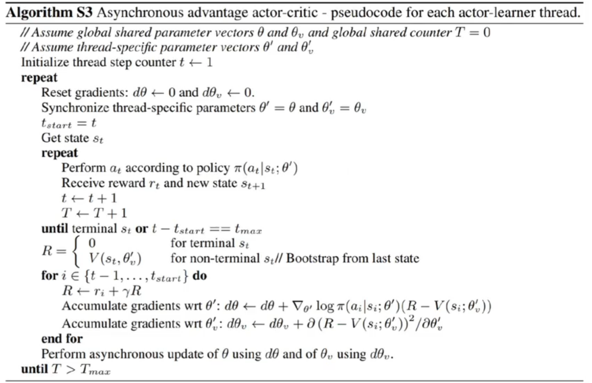

# Policy Based Methods for Deep RL

## 1 异步优势动作评价（Asynchronous Advantage Actor Critic）

A3C算法A3C算法的核心思想是通过多个并行的交互环境来加速学习过程。

通过让多个拷贝全局网络参数的agent同时与各自的环境副本进行交互，并独立地计算梯度，并传播至全局网络，从而实现了更高效的探索和更快的学习速度。

每个agent都会根据自己与环境交互得到的经验来对全局网络进行微小的更新，这样可以有效地减少方差，并且有助于避免陷入局部最优解。

## 2 信任区域策略优化（TRPO）

### 2.1 策略梯度方法的局限性

传统的策略梯度方法的一般思路是：

- 参数化智能体策略
- 设计衡量策略好坏的目标函数
- 通过梯度上升的方式最大化目标函数，使得策略最优

策略梯度法的优化目标表示为：
$$\mathcal{J}(\theta)=\mathbb{E}_{s_0}[V^{\pi_\theta}(s_0)]=\mathbb{E}_{s_0}[\sum_{t=0}^\infty\gamma^tV^{\pi_\theta}(s_t)]$$

$$\theta^*=\arg\max_\theta \mathcal{J}(\theta)$$

策略梯度方法沿着 $\nabla_\theta\mathcal{J}(\theta)$ 的方向迭代更新策略参数 $\theta$。这种算法的明显缺点是：当策略网络是深度学习模型时，沿着策略梯度更新参数 $\theta$ 可能由于步长过长而导致策略突然变差，进而影响训练效果。

针对以上问题，我们考虑在更新时找到一块*信任区域*（trust region），在该区域内更新策略时能得到某种策略性能的安全性保证，这就是*信任区域策略优化*（TRPO）的主要思想。

### 2.2 策略目标

由于初始状态 $s_0$ 的分布与策略无关，因此上述策略 $\pi_\theta$ 下的优化目标 $\mathcal{J}(\theta)$ 可以写作新策略 $\pi_{\theta'}$ 下的期望形式：
$$\begin{aligned}
    \mathcal{J}(\theta)&=\mathbb{E}_{s_0}[V^{\pi_\theta}(s_0)]\\
    &=\mathbb{E}_{\pi_{\theta'}}\left[\sum_{t=0}^{\infty}\gamma^tV^{\pi_\theta}(s_t)-\sum_{t=1}^{\infty}\gamma^tV^{\pi_\theta}(s_t)\right]\\
    &=-\mathbb{E}_{\pi_{\theta'}}\left[\sum_{t=0}^{\infty}\gamma^t(\gamma V^{\pi_\theta}(s_{t+1})-V^{\pi_\theta}(s_t))\right]\\
\end{aligned}$$

因此，新旧策略目标函数之间的差异是：
$$\begin{aligned}
    \mathcal{J}(\theta')-\mathcal{J}(\theta)&=\mathbb{E}_{s_0}[V^{\pi_{\theta'}}(s_0)]-\mathbb{E}_{s_0}[V^{\pi_\theta}(s_0)]\\
    &=\mathbb{E}_{\pi_{\theta'}}\left[\sum_{t=0}^{\infty}\gamma^tV^{\pi_{\theta'}}(s_t)\right]+\mathbb{E}_{\pi_{\theta'}}\left[\sum_{t=0}^{\infty}\gamma^t(\gamma V^{\pi_\theta}(s_{t+1})-V^{\pi_\theta}(s_t))\right]\\
    &=\mathbb{E}_{\pi_{\theta'}}\left[\sum_{t=0}^{\infty}\gamma^t[V^{\pi_{\theta'}}(s_t)+\gamma V^{\pi_\theta}(s_{t+1})-V^{\pi_\theta}(s_t)]\right]\\
    &=\mathbb{E}_{\pi_{\theta'}}\left[\sum_{t=0}^{\infty}\gamma^tA^{\pi_\theta}(s_t,a_t)\right]\\
    &=\sum_{t=0}^{\infty}\gamma^t\mathbb{E}_{s_t\sim P_t^{\pi_{\theta'}}}\mathbb{E}_{a_t\sim\pi_{\theta'(\dot|s_t)}}[A^{\pi_{\theta}}(s_t,a_t)]\\
    &=\frac{1}{1-\gamma}\mathbb{E}_{s\sim v^{\pi_{\theta'}}}\mathbb{E}_{a\sim\pi_{\theta'(\sdot|s)}}[A^{\pi_{\theta}}(s_t,a_t)]\\
\end{aligned}$$

最后一个等号的成立用到了状态访问分布的定义：
$$v^{\pi}(s)=(1-\gamma)\sum_{t=0}^{\infty}\gamma^tP_t^\pi(s)$$

因此，保证新策略性能上升的条件是：
$$\mathbb{E}_{s\sim v^{\pi_{\theta'}}}\mathbb{E}_{a\sim\pi_{\theta'(\dot|s)}}[A^{\pi_{\theta}}(s_t,a_t)]\geq0$$

直接对该式进行求解是困难的，因为 $\pi_{\theta'}$ 既决定了样本的分布，又是求解的对象，因此 TRPO 算法进行了近似，忽略了两个策略之间状态访问分布的变化，直接使用旧的策略 $\pi_\theta$ 的状态分布，定义以下替代优化目标：
$$\mathcal{L}_{\theta}(\theta')=\mathcal{J}(\theta)+\frac{1}{1-\gamma}\mathbb{E}_{s\sim v^{\pi_{\theta}}}\mathbb{E}_{a\sim\pi_{\theta'(\sdot|s)}}[A^{\pi_{\theta}}(s_t,a_t)]$$

在新旧策略十分接近时，这个近似是合理的，同时可以使用重要性采样处理动作的采样：
$$\mathcal{L}_{\theta}(\theta')=\mathcal{J}(\theta)+\frac{1}{1-\gamma}\mathbb{E}_{s\sim v^{\pi_{\theta}}}\mathbb{E}_{a\sim\pi_{\theta(\sdot|s)}}[\frac{\pi_{\theta'}(a|s)}{\pi_{\theta}(a|s)}A^{\pi_{\theta}}(s_t,a_t)]$$

为了确保新旧策略之间的差距足够小，TRPO 使用 KL 散度衡量二者的差距：
$$\max_{\theta'}\mathcal{L}_{\theta}(\theta')$$

$$\mathbf{s.t.}~~~\mathbb{E}_{s\sim v^{\pi_{\theta_k}}}[D_{KL}(\pi_{\theta_k}(\sdot|s)||\pi_{\theta'}(\sdot|s))]\leq\delta$$

其中 $\theta_k$ 表示经过 $k$ 次迭代之后的策略。

然而，直接求解上式是困难的，TRPO 算法首先对目标函数和约束条件分别进行泰勒展开近似：
$$\mathbb{E}_{s\sim v^{\pi_{\theta}}}\mathbb{E}_{a\sim\pi_{\theta(\sdot|s)}}[\frac{\pi_{\theta'}(a|s)}{\pi_{\theta}(a|s)}A^{\pi_{\theta}}(s_t,a_t)]\approx \mathbf{g}^\top(\theta'-\theta_k)$$

$$\mathbb{E}_{s\sim v^{\pi_{\theta_k}}}[D_{KL}(\pi_{\theta_k}(\sdot|s)||\pi_{\theta'}(\sdot|s))]\approx\frac{1}{2}(\theta'-\theta)^\top\mathbf{H}(\theta'-\theta)$$

于是优化目标可以写作：
$$\theta_{k+1}=\arg\max_{\theta'}\mathbf{g}^\top(\theta'-\theta_k)$$

$$\mathbf{s.t.}~~~\frac{1}{2}(\theta'-\theta)^\top\mathbf{H}(\theta'-\theta)\leq\delta$$

根据 **KKT 条件**直接推出优化问题的解：
$$\theta_{k+1}=\theta_k+\sqrt{\frac{2\delta}{\mathbf{g^\top}\mathbf{H}^{-1}\mathbf{g}}}\mathbf{H}^{-1}\mathbf{g}$$

### 2.3 共轭梯度法

由于神经网络表示的策略函数的参数量是巨大的，因此计算和维护 Hessian 矩阵的逆的成本是高昂的，TRPO 算法使用共轭梯度法回避了这个问题，共轭梯度法直接计算 $\mathbf{x}=\mathbf{H}^{-1}\mathbf{g}$，$x$ 即参数更新方向，假设满足 KL 散度约束的最大步长为 $\beta$，则有 $\frac{1}{2}(\beta \mathbf{x})^\top\mathbf{H}(\beta \mathbf{x})=\delta$，即 $\beta=\sqrt{\frac{2\delta}{\mathbf{x}^\top\mathbf{H}\mathbf{x}}}$，参数更新方式可以表示为：
$$\theta_{k+1}=\theta_k+\sqrt{\frac{2\delta}{\mathbf{x}^{-1}\mathbf{H}\mathbf{x}}}\mathbf{x}$$

因此，只要可以直接计算 $\mathbf{x}$ 就可以直接进行迭代优化而无需计算 Hessian 矩阵的逆，所以问题转化为解 $\mathbf{Hx}=\mathbf{g}$，由于 $\mathbf{H}$ 是一个对称正定矩阵，所以可以使用共轭梯度法求解：

---

初始化 $\mathbf{r_0}=\mathbf{g}-\mathbf{Hx_0}$，$\mathbf{p}_0=\mathbf{r}_0$，$\mathbf{x}_0=0$

**for** $k=0\rightarrow N$ **do**:
$~~~\alpha_k=\frac{\mathbf{r}_k^\top\mathbf{r}_k}{\mathbf{p}_k^\top\mathbf{H}\mathbf{p}_k}$
$~~~\mathbf{x}_{k+1}=\mathbf{x}_k+\alpha_k\mathbf{p}_k$
$~~~\mathbf{r}_{k+1}=\mathbf{r}_k-\alpha_k\mathbf{H}\mathbf{p}_k$
$~~~$如果 $\mathbf{r}_k^\top\mathbf{r}_k$ 足够小，则退出循环
$~~~\beta_k=\frac{\mathbf{r}_{k+1}^\top\mathbf{r}_{k+1}}{\mathbf{r}_k^\top\mathbf{r}_k}$
$~~~\mathbf{p}_{k+1}=\mathbf{r}_{k+1}+\beta_k\mathbf{p}_k$
**end for**
输出 $\mathbf{x}_{N+1}$

---

在共轭梯度法中，直接计算 $\alpha_{k}$ 和 $\mathbf{r}_{k+1}$ 需要计算和存储 Hessian 矩阵，为了避免这一点，我们可以直接维护 $\mathbf{Hx}$，因为：
$$\mathbf{Hx}=\nabla_\theta\left((\nabla_\theta(D_{KL}^{v^{\pi_{\theta_k}}}(\pi_{\theta_k}||\pi_{\theta_{k'}})))^\top\right)\mathbf{x}=\nabla_\theta\left((\nabla_\theta(D_{KL}^{v^{\pi_{\theta_k}}}(\pi_{\theta_k}||\pi_{\theta_{k'}})))^\top\mathbf{x}\right)$$

### 2.4 线性搜索

由于泰勒展开近似的存在，$\theta'$ 可能未必优于 $\theta$ 或者满足 KL 散度限制，因此 TRPO 算法在每次迭代的最后进行一次*线性搜索*（line search），以确保满足条件。每次线性搜索时，找到一个最小非负整数 $i$，使得按照：
$$\theta_{k+1}=\theta_k+\alpha^i\sqrt{\frac{2\delta}{\mathbf{x}^\top\mathbf{H}\mathbf{x}}}，\alpha\in(0,1)$$

求出的 $\theta_{k+1}$ 仍然满足最初的 KL 散度限制，并且确实对目标函数有所提升，相当于最后再对学习率进行一次调整。

### 2.5 广义优势估计

在 TRPO 中，使用*广义优势估计*（GAE）的方法对优势函数 $A$ 进行估计，根据多步时序差分的思想，有：
$$\begin{aligned}
    A_t^{(1)}&=\delta_t&=-V(s_t)+\mathbf{r}_t+\gamma V(s_{t+1})\\
    A_t^{(2)}&=\delta_t+\gamma \delta_{t+1}&=-V(s_t)+\mathbf{r}_t+\gamma \mathbf{r}_{t+1}+\gamma^2V(s_{t+2})\\
    A_t^{(3)}&=\delta_t+\gamma \delta_{t+1} +\gamma^2 \delta_{t+2}&=-V(s_t)+\mathbf{r}_t+\gamma \mathbf{r}_{t+1}+\gamma^2 \mathbf{r}_{t+2}+\gamma^3V(s_{t+3})\\
    \dotsb\\
    A_t^{(k)}&=\sum_{l=0}^{k-1}\gamma^l\delta_{t+l}&=-V(s_t)+\mathbf{r}_t+\gamma \mathbf{r}_{t+1}+\gamma^2 \mathbf{r}_{t+2}+\dotsb+\gamma^{k-1}\mathbf{r}_{t+k-1}+\gamma^kV(s_{t+k})\\
\end{aligned}$$

然后，GAE 使用不同部步数的优势估计进行指数加权平均（类似于 TD(λ) 的做法）：
$$\begin{aligned}
    A_t^{GAE}&=(1-\lambda)(A^{(1)}_t+\lambda A^{(2)}_t+\lambda^2 A^{(3)}_t+\dotsb)\\
    &=(1-\lambda)(\delta_t+\lambda (\delta_t+\gamma \delta_{t+1})+\lambda^2 (\delta_t+\gamma \delta_{t+1} +\gamma^2 \delta_{t+2})+\dotsb)\\
    &=(1-\lambda)(\delta_t(1+\lambda+\lambda^2)+\gamma\delta_{t+1}(\lambda+\lambda^2+\lambda^3)+\dotsb)\\
    &=(1-\lambda)\left(\delta_t\frac{1}{1-\lambda}+\gamma\delta_{t+1}\frac{\lambda}{1-\lambda}+\dotsb\right)\\
    &=\sum_{l=0}^\infty(\gamma\lambda)^l\delta_{t+l}，\gamma\in[0,1]\\
\end{aligned}$$

## 3 近端策略优化（PPO）

PPO 是一种 TRPO 的改进算法，主要解决了 TRPO 计算流程极其复杂，计算量大的缺陷。

### 3.1 PPO-惩罚

PPO 用拉格朗日乘数法将 KL 散度直接置于目标函数中，将约束优化问题转化为无约束优化问题：
$$\arg\max_\theta \mathbb{E}_{s\sim v^{\pi_{\theta}}}\mathbb{E}_{a\sim\pi_{\theta(\sdot|s)}}\left[\frac{\pi_{\theta'}(a|s)}{\pi_{\theta}(a|s)}A^{\pi_{\theta}}(s_t,a_t)-\beta D_{KL}(\pi_{\theta_k}(\sdot|s)||\pi_{\theta'}(\sdot|s))\right]$$

其中 $\beta$ 是一个迭代过程中不断更新的参数，令 $d_k=D_{KL}(\pi_{\theta_k}(\sdot|s)||\pi_{\theta'}(\sdot|s))$，则 $\beta$ 更新规则是：

- 如果 $d_k<\delta/1.5$，则 $\beta_{k+1}=\beta_k/2$
- 如果 $d_k>1.5\delta$，则 $\beta_{k+1}=2\beta_k$
- 否则 $\beta_{k+1}=\beta_k$

### 3.2 PPO 截断

PPO 的另一种形式是直接在目标函数中进行限制，通过截断的方式使得新的策略函数参数与旧的参数的差距不会过大，即：
$$\arg\max_\theta \mathbb{E}_{s\sim v^{\pi_{\theta}}}\mathbb{E}_{a\sim\pi_{\theta(\sdot|s)}}\left[\min\left(\frac{\pi_{\theta'}(a|s)}{\pi_{\theta}(a|s)}A^{\pi_{\theta_k}}(s|a),\mathbf{clip}\left(\frac{\pi_{\theta'}(a|s)}{\pi_{\theta}(a|s)},1-\epsilon,1+\epsilon \right)A^{\pi_{\theta_k}}(s|a)\right)\right]$$

当 $A^{\pi_{\theta_k}}(s|a)>0$ 时，说明这个动作的价值高于平均值，最大化这个式子会增大 $\frac{\pi_{\theta'}(a|s)}{\pi_{\theta}(a|s)}$，但不会使其大于 $1+\epsilon$。反之，$A^{\pi_{\theta_k}}(s|a)<0$ 时，说明动作的价值低于平均价值，最大化这个式子会减小 $\frac{\pi_{\theta'}(a|s)}{\pi_{\theta}(a|s)}$，但不会使之小于 $1-\epsilon$。
