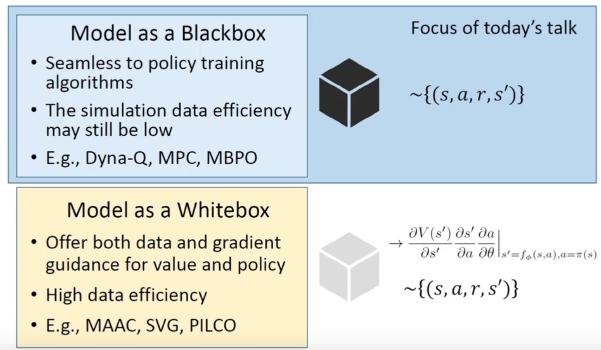
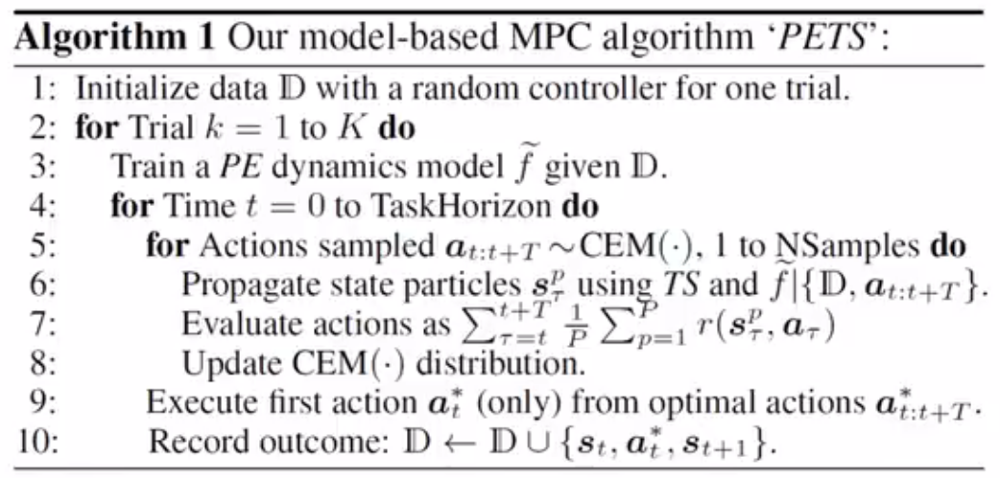
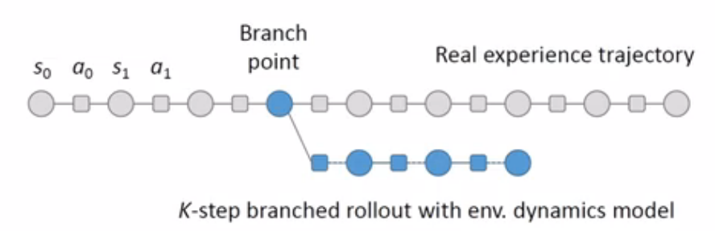
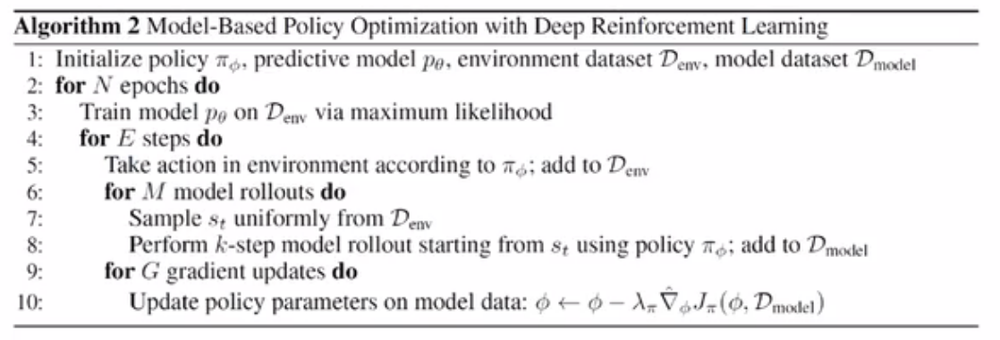
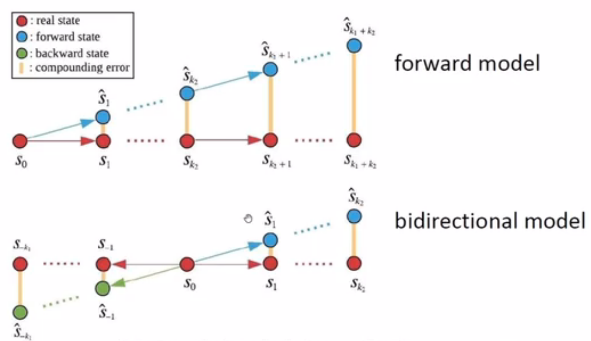
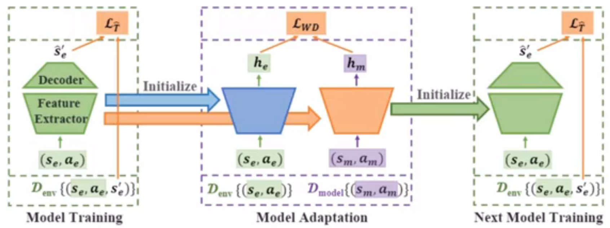
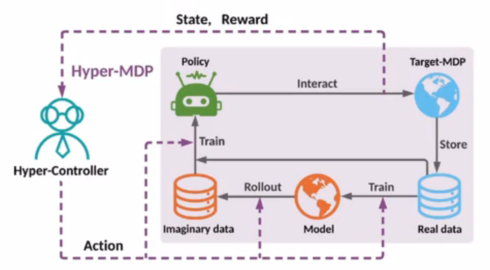

# Model-based RL

## 1 Model-based RL VS Model-free RL

- **Model-based RL**
  - 模型构建完成之后进行同策略学习
  - 模型构建完成之后可能无需继续与真实环境交互
  - 更高的*采样效率*（sample efficiency）
  - 模型本身会引入额外的误差
- **Model-free RL**
  - 最佳的渐近性能
  - 适合大数据量的深度学习架构
  - 不稳定的异策略学习
  - 低采样效率，需要大量的训练数据

黑盒模型仅仅能够从中采样，而白盒模型本身就可以提供优化的方向信息。

MBRL 中有这样一些关键问题：

- 如何基于经验数据正确地训练模型
- 如何处理模型的不准确和复合误差的问题
- 如何高效利用模型训练策略
- 如何确保模型带来真实的策略提升

## 2 Shooting Methods

*打靶法*（shooting methods）是一种*模型预测控制*（model predictive method）算法，这类算法并不显式地构建策略，而是根据环境模型选择当前步要采取的动作。

打靶法的一般思路是：

- 选择一系列长度为 $T$ 的动作序列：
$$[a_0,a_1,\dotsb,a_T]$$
- 依据动作序列从模型中采样轨迹：
$$[s_0,a_0,\hat{r}_0,s_1,a_1,\hat{r}_1,\dotsb,s_T,a_T,\hat{r}_T]$$
- 然后选择回报最高的动作序列作为策略：
$$\hat{Q}(s,a)=\sum_{t=0}^T\gamma^t\hat{r}_t$$

$$\pi(s)=\arg\max_a\hat{Q}(s,a)$$

不同的 shooting methods 的区别主要在于动作序列的选择。

### 2.1 Random Shooting（RS）

*随机打靶法*（random shooting）随机选择动作序列。
优点在于：

- 低计算负担
- 易于实施
- 无需提前指定任务范围

缺陷是：

- 高方差
- 可能为对高回报动作采样

### 2.2 Cross Entropy Method（CEM）

*交叉熵法*（cross entropy method） 是一种进化策略方法，它的核心思想是维护一个带参数的分布，根据每次采样的结果来更新分布中的参数使分布中能获得较高累计奖励的动作序列的概率比较高。

### 2.3 Probabilistic Ensembles with Trajectory Sampling（PETS）

*带有轨迹采样的概率集成*（PETS）是一种使用 MPC 的基于模型的强化学习算法，在 PETS 中，环境模型使用集成学习方法，即构建多个环境模型，使用多个环境模型进行预测，最后使用 CEM 进行模型预测控制。

我们通常认为一个系统中有两种不确定性，分别是**偶然不确定性（aleatoric uncertainty）和认知不确定性（epistemic uncertainty）**，前者是由于系统中本身存在的随机性引起的，而后者是由数据的稀缺引起的。

在 PETS 中，我们同时考虑这两种不确定性，首先，定义一个环境模型的输出为一个高斯分布，用于捕获偶然不确定性，令环境模型为 $\hat{P}$，其参数为 $\theta$，那么基于当前状态动作对 $(s_t,a_t)$，下一个状态 $s_t$ 的分布可以写作：
$$\hat{P}_\theta(s_t,a_t)=\mathcal{N}(\mu_\theta(s_t,a_t),\Sigma_\theta(s_t,a_t))$$

分别构建均值和协方差的神经网络，损失函数表示为：
$$\mathcal{L}(\theta)=\sum_{n=1}^N[\mu_\theta(s_n,a_n)-s_{n+1}]^\top\Sigma_\theta^{-1}(s_n,a_n) [\mu_\theta(s_n,a_n)-s_{n+1}]+\log \det \Sigma_\theta^{-1}(s_n,a_n)$$

PETS 通过集成学习的方式捕获认知不确定性，PETS 构建 $B$ 个网络框架一样的神经网络，采用不同的参数随机初始化方式，并对真实数据进行子采样。

完成环境模型的构建之后，在每一次预测下一个状态时从所有 $B$ 个模型中随机挑选一个进行预测，一条轨迹的采样涉及多个子模型。

PETS 比较适用于自由度较低的、较稳定的环境。

## 3 基于模型的策略优化（MBPO）

### 3.1 Branched Rollout

MBPO 算法基于两个关键的观察：

- 随环境模型推演步数的增加，模型累积的复合误差会快速增加，使模型结果不可靠
- 必须要权衡推演步数增加后模型增加的误差带来的负面作用与步数增加后使得训练策略更优的正面作用，二者的权衡决定了推演的步数

在 MBPO 中，*分支推演*（branched rollout）指的是在原来真实环境中采样的轨迹上推演出新的“短分支”，使得模型的误差累积不至于过大，从而保证采样效率和策略表现。

### 3.2 Model Error & Policy Value Discrepancy

我们希望策略在模型环境中的期望回报 $\eta[\pi]$ 和真实环境中的期望回报 $\hat{\eta}[\pi]$ 之间的差距有一定的限制：
$$\eta[\pi]\geq\hat{\eta}[\pi]-C$$

使用 total variance distance 衡量分布之间的差异：
$$D_{TV}=\frac{1}{2}\int|\mu(A)-v(A)|$$

刻画当前策略 $\pi$ 与数据收集策略 $\pi_D$ 之间的*策略转移*（policy shift）：
$$\epsilon_\pi=\max_sD_{TV}(\pi||\pi_D)$$

表示在模型的泛化误差：
$$\epsilon_m=\max_t\mathbb{E}_{s\sim\pi_{D,t}}[D_{TV}(p(s',r|s,a)||p_\theta(s',r|s,a))]$$

MBPO 中估计出这样一个下界：
$$\eta[\pi]\geq\hat{\eta}[\pi]-\left[\frac{2\gamma \mathbf{r}_{\max}(\epsilon_m+2\epsilon_\pi)}{(1-\gamma)^2}+\frac{4\mathbf{r}_{\max}\epsilon_\pi}{1-\gamma}\right]$$

在分支推演中，我们并不是从头开始由模型收集数据，而是从由之前的策略访问的状态下开始进行推演，如果使用当前策略 $\pi_t$ 而非之前的数据收集策略 $\pi_{D,t}$ 来估计模型误差，则有：

$$\epsilon_{m}'=\max_t\mathbb{E}_{s\sim\pi_{t}}[D_{TV}(p(s',r|
s,a)||p_\theta(s',r|s,a))]$$

进行线性近似：
$$\epsilon'_m\approx\epsilon_m+\epsilon_\pi\frac{d\epsilon_m'}{d\epsilon_\pi}$$

在 $k$ 步分支推演下，策略期望回报误差的下界可以写作：

$$\eta[\pi]\geq\eta^{branch}[\pi]-2\mathbf{r}_{\max}\left[\frac{\gamma^{k+1}\epsilon_\pi}{(1-\gamma)^2}+\frac{\gamma^k\epsilon_\pi}{1-\gamma}+\frac{k\epsilon_{m'}}{1-\gamma}\right]$$

理论最优的推演步长是：
$$k^*=\arg\min_k\left[\frac{\gamma^{k+1}\epsilon_\pi}{(1-\gamma)^2}+\frac{\gamma^k\epsilon_\pi}{1-\gamma}+\frac{k\epsilon_{m'}}{1-\gamma}\right]$$

当 $\frac{d\epsilon_{m'}}{d\epsilon_\pi}$ 足够小时，使得 $k^*>0$，此时分支推演就是有效的。

对于高随机性的离散状态，环境模型的拟合精度较低，此时分支推演的方式就不再合适。

### 3.3 MBPO Algorithm

### 3.4 Bidirectional Model

与 MBPO 算法类似的 MBRL 算法的设计都围绕降低策略价值估计误差进行：
$$[\eta[\pi]-\hat{\eta}[\pi]]\leq C(\epsilon_m,\epsilon_\pi)$$

这类算法的思路一般是：

- 推导出 $C(\epsilon_m,\epsilon_\pi)$ 的表示形式
- 设计算法降低该项

*双向模型*（bidirectional model）是建立在 MBPO 基础上的 MBRL 模型，它的主要改进是将推演方向由单向（向未来推演）改进为双向。

这种模式可以将复合误差分散至两个方向，因此总误差较低，采样效率较高。

### 3.5 Distribution Mismatch in MBRL

在 MBRL 中，我们用于训练模型的数据的采样策略与从模型中采样的策略往往是不同的，二者的占用度量之间的差异形成了明显的错配：
$$p_{train}(s,a)\not =p_{rollout}(s,a)$$

那么我们可以对模型的损失函数进行扩充，使得模型能够缩小训练数据和采样数据之间的分布差异。

### 3.6 AutoMBPO Framework

随模型训练和真实环境采样的不断进行，由于经验数据量逐渐增加，我们可以下调使用模拟数据的比率。我们可以把对模型进行超参数调整的任务视作为一个 MDP 环境下的问题，而 AutoMBPO 使用一个单独的模型完成该任务。

