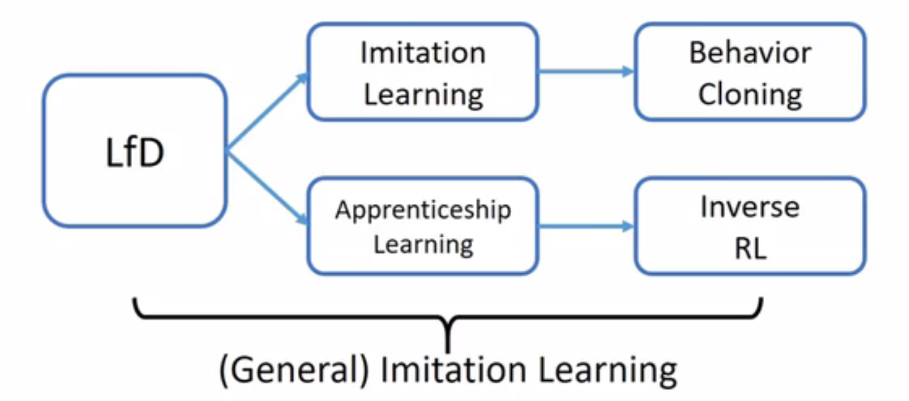
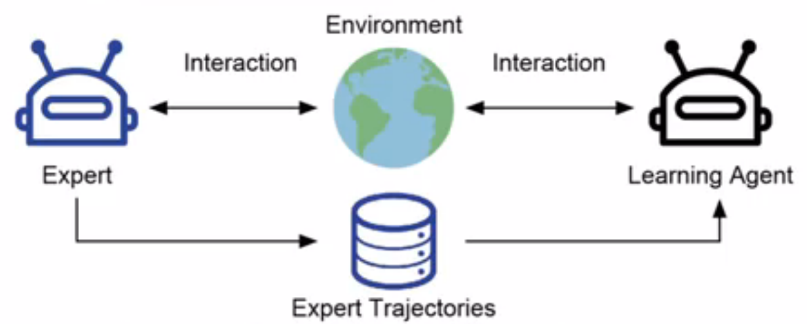
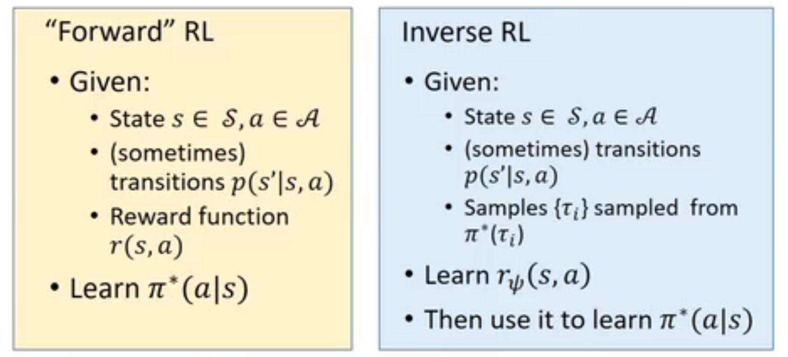
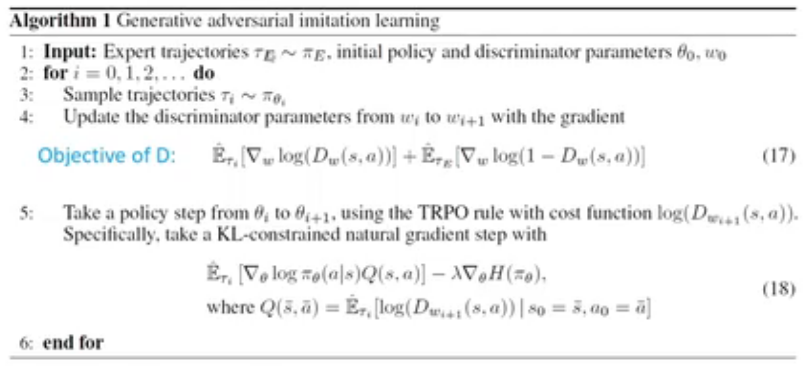

# Imitation Learning

## 1 Introduction to Imitation Learning

传统强化学习任务十分依赖奖励函数的设置，但是在很多现实场景中，可能会出现难以明确即时奖励的情况，例如自动驾驶、计算机游戏等，此时随机设计的奖励函数将无法保证强化学习训练出的策略满足实际需要。

*模仿学习*（imitation learning）目的是模仿专家智能体的决策行为，借此绕开传统强化学习对奖励信号的要求。

目前模范学习方法大致可以分为三类：

- 行为克隆（behavior cloning）
- 逆强化学习（inverse RL）
- 生成对抗式强化学习（generative adversarial imitation learning，GAIL）

一般来说，模仿学习的智能体有以下性质：

- 可以取得（非交互的）专家智能体的轨迹数据
- 可以与环境或模拟器交互
- 无法取得奖励信号

此外，有一些可选的额外设定：

- 缺少动作的观察而只有状态的观察
- 带有奖励信号
- 交互式的专家智能体
- 不可与环境交互

模仿学习的目标可以被表示为：
$$\pi^*=\arg\min_\pi\mathbb{E}_{s\sim{\rho_\pi^s}}[\mathcal{L}(\pi(\sdot|s),\pi_E(\sdot|s))]$$

$$\rho_\pi(s)=(1=\gamma)\sum_{t=0}^\infty\gamma^tP(s_t=s|\pi)$$

$\mathcal{L}(\sdot)$ 表示某些描述分布距离的损失函数。

## 2 Behavior Cloning（BC）

*行为克隆*（behavior cloning）就是直接使用监督学习方法，将专家数据中 $(s_t,a_t)$ 中的 $s_T$ 看作样本输入，将 $a_t$ 看作标签，学习的目标为：
$$\theta^*=\arg\min_\theta\mathbb{E}_{(s,a)\sim B}[\mathcal{L}(\pi_\theta(s),a)]$$

其中，$B$ 是专家的数据集，$\mathcal{L}$ 对应有监督学习下的损失函数，若动作是离散的，则可以选择交叉熵等分类损失；若动作是连续的，可以选择 MSE 等回归损失。

BC 的实现相当简单，而且智能体无需与环境进行交互。

BC 在数据量较小时存在明显的局限性，在智能体决策的过程中，在稀缺专家数据的状态下会产生较大的误差，这种误差在序贯决策的过程中不断累积，最终导致严重的复合误差问题。

## 3 Inverse Reinforcement Learning（IRL）

*逆向强化学习*（inverse reinforcement learning）的范式是先学习奖励函数，再进行正向的强化学习。

逆向强化学习的目标可以被表示为：
$$\pi^*=\arg\max_\pi\mathbb{E}_{(s,a)\sim\rho_\pi}[r^*(s,a)]$$

$r^*$ 是参数化的奖励函数：
$$r^*=\arg\max_r\mathbb{E}\left[\sum_{t=0}^\infty\gamma^tr(s,a)|\pi^*\right]-\mathbb{E}\left[\sum_{t=0}^\infty\gamma^tr(s,a)|\pi\right]$$

奖励函数的优化目标可以理解为使得专家策略（最优策略）和其他策略的奖励的差距增加。

一种对经典逆向强化学习的改进是最大熵逆向强化学习（max-entropy IRL），其使用成本函数代替奖励函数，并在目标中增加了最大熵项。
$$c^*=IRL(\pi_E)=\arg\max_c{\left[(\min_\pi-H(\pi)+\mathbb{E}_\pi|c(s,a)|)-\mathbb{E}_{\pi_E}|c(s,a)|\right]}$$

在 $c^*$ 下进行正向强化学习恢复策略：
$$\pi^*=RL(c^*)=\arg\max_{\pi\in H}-H(\pi)+E_\pi[c^*(s,a)]$$

## 4 Generative Adversarial Imitation Learning（GAIL）

*生成对抗式模仿学习*（generative adversarial imitation learning）类似于GAN，通过一个最小最大化的优化目标直接匹配当前策略和专家策略的占用度量：
$$\min_G\max_D\mathbb{E}_{x\sim P_{data}}[\log D(x)]+\mathbb{E}_{x\sim P_{G}}[\log(1-D(x))]$$

在算法实现中，判别器以传统的有监督学习的方式训练，生成器则以判别器表示的奖励信号 $\log D(s,a)$，通过 TRPO 或 PPO 的方式学习。

在专家轨迹数据较少的情况下，使用 GAIL 通常更有效。

## 5 Recent Works

### 5.1 Soft Q Imitation Learning（SQIL）

定义奖励函数：

- 对于专家数据：
$$r(s^*,a^*)=1$$

- 对于其他数据：
$$r(s,a)=0$$

然后通过异策略强化学习的方式进行优化：

- 以专家数据初始化经验池
- 想经验池中加入新采样的数据
- 通过 Soft Q Learning/Soft AC 的方式学习

### 5.2 Random Expert Distillation（RED）

在 RED 中，使用两个神经网络，其中有 $f_\theta(s,a)$ 为一个随机参数的神经网络，接受状态-动作对作为输入，输出常数，$f_{\hat{\theta}}(s,a)$ 是通过 MSE 损失拟合 $f_\theta(s,a)$ 对专家数据输出的神经网络：
$$\hat{\theta}=\arg\min_{\theta'}||f_{\theta'}(s,a)-f_\theta(s,a)||^2$$

这使得在专家数据上，两个神经网络的预测较接近，而在其他数据上，由于认知不确定性的存在，两个模型的输出结果相差较大，因此可以设计奖励函数：
$$r(\sdot)=e^{-\sigma||f_{\hat{\theta}(s,a)-f_\theta(s,a)}||^2}$$

然后使用此奖励函数然进行正向的强化学习。

### 5.3 Disaggreement-Regularized IL（DRIL）

DRIL 的动机主要是驱动智能体决策向专家数据的分布靠拢。DRIL 对专家数据进行子采样，通过行为克隆训练若干个智能体，由这些智能体决策的方差决定数据是否位于专家数据分布内：
$$C_U(s,a)=Var_{\pi\sim p(\pi|D)}(\pi(a|s))$$

在专家数据分布内，各智能体决策的方差应该较小。
由此定义成本函数：
$$C_U^{clip}(s,a)=\begin{cases}
    -1& if C_U(s,a)\leq q\\
    1&otherwise
\end{cases}$$

然后进行正向强化学习。

## 6 GAN & RL

- 对于连续数据：
  - 确定性策略梯度(DPG)：
  $$\frac{\partial\mathcal{J}(\pi_\theta)}{\partial\theta}=\mathbb{E}_{s\sim\rho^\pi}\left[\frac{\partial Q^\pi(s,a)}{\partial a}\frac{\partial \pi_\theta(s)}{\theta}\Big|_{a=\pi_\theta(s)}\right]$$
  - GAN：
  $$\frac{\partial \mathcal{J}(G_\theta,D)}{\partial \theta}=\mathbb{E}_{z\sim p(z)}\left[\frac{\partial \mathcal{J}(G_\theta,D(x))}{\partial x}\frac{\partial G_\theta(z)}{\partial \theta}\Big|_{x=G_\theta(z)}\right]$$
- 对于离散数据：
  - 随机策略梯度（PG）
  $$\frac{\partial\mathcal{J}(\pi_\theta)}{\partial\theta}=\mathbb{E}_{\pi_\theta}\left[\frac{\log\pi_\theta(a|s)}{\partial \theta}Q^{\pi_\theta}(s,a)\right]$$
  - GAN
  $$\frac{\partial \mathcal{J}(G_\theta,D)}{\partial \theta}=\mathbb{E}_{x\sim G_\theta}\left[\frac{\partial \log G_\theta(\pi)}{\partial \theta}D(x)\right]$$
