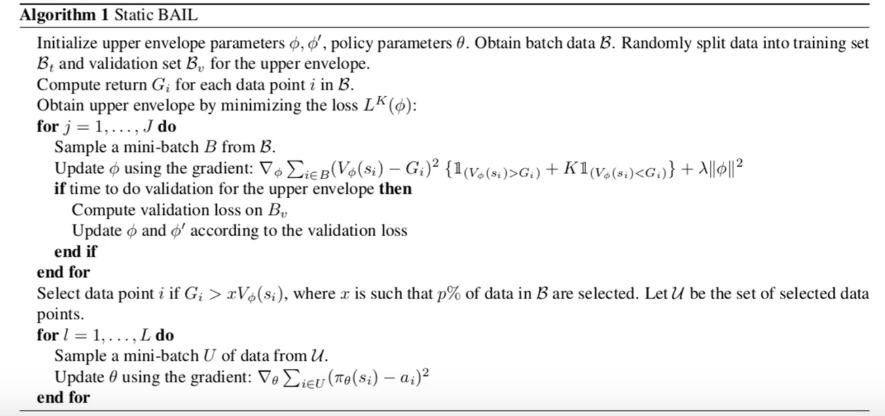

# Offline Reinforcement Learning

*离线强化学习*（offline reinforcement learning）的目标是，在智能体不和环境交互的情况下，仅从已经收集好的确定的数据集中，通过强化学习得到较好的策略，从而避免在训练阶段对真实环境造成干扰。

## 1 Extrapolation Error

离线强化学习与异策略强化学习算法有一些共同之处，例如都需要通过经验回放池优化策略，但是将异策略强化学习算法直接迁移至离线环境的效果极差，而*外推误差*（extrapolation error）是造成这一点的主要原因。

外推误差，是指由于当前策略访问到的状态动作对与从数据集中采样得到的状态动作对的分布不匹配产生的误差。在线环境下的异策略学习有机会通过与环境交互及时采样得到新的数据从而修正这些误差，而离线环境下，智能体无法和环境交互，因此，一般来说离线强化学习需要尽可能限制外推误差的大小，从而得到较好的策略。

## 2 Bach-Constrained Q-Learning（BCQ）

为了减少外推误差，只需要确保当前策略只访问与数据集中接近的 $(s,a)$ 数据即可，这就是*批量限制 Q-learning*（batch-constrained Q-learning）的核心。

这种模式下的最优化策略称为*批量限制策略*（batch-constrained policy），其满足以下几个条件：

- 最小化选择的动作与数据集中数据的距离
- 采取动作后能到达与离线数据集中状态相似的状态
- 最大化目标函数 $Q$

在表格环境下，批量限制 Q-learning的更新公式可以表示为；
$$Q(s,a)\leftarrow(1-\alpha)Q(s,a)+\alpha (r+\gamma Q(s',\arg\max_{a's.t.(s',a')\in D}Q(s',a')))$$

在连续环境下，我们还需要衡量状态动作对之间的距离以便确定状态动作对是否接近数据集分布，如果和表格环境一样只是使用数据集已有的状态动作对训练会使得模型的泛化效果极差。

BCQ 使用的方法是训练一个生成模型（通常由VAE实现）$G_\omega(s)$，对于数据集中的一系列状态 $s_1,s_2,\dotsb$，生成式模型可以给出一系列动作 $a_1,a_2,\dotsb$。同时 BCQ 引入一个扰动模型 $\xi_\phi(s,a,\Phi)$，当输入 $(s,a)$ 时，模型会向动作添加一个最大为 $\Phi$ 的扰动。这种情况下，批量限制策略可以写作：
$$\pi(s)=\arg\max_{a_i+\xi_\phi(s,a_i,\Phi)}Q_\theta(s,a_i+\xi_\phi(s,a_i,\Phi)),~~~a_I\in G_\omega(s)$$

扰动模型可以通过确定性策略梯度算法实现，目标是使函数 $Q$ 最大化：
$$\phi\leftarrow\arg\max_\phi\sum_{(s,a)\in D}Q_\theta(s,a+\xi_\phi(s,a,\Phi))$$

## 3 Conservative Q-Learning

保守 Q-Learning（conservative Q-learning）的思想是通过在贝尔曼方程中引入一些额外的限制项目，将算法中偏离数据集的点上的 $Q$ 函数限制在较低的水平，以此消除外推误差的影响。

传统 Q-learning 中，$Q$ 的更新方程可以写作：
$$\widetilde{Q}^{k+1}\leftarrow\arg\min_Q\mathbb{E}_{(s,a)\sim D}[(Q (s,a)-\hat{B}^\pi\hat{Q}^k(s,a))^2  ]$$

其中 $\hat{B}^\pi$ 表示策略 $\pi$ 的贝尔曼算子：
$$\hat{B}^\pi Q(s,a)=r(s,a)+\gamma\sum_{s'}P(s'|s,a)\sum_{a'}\pi(a'|s')Q(s',a')$$

一般我们需要使得 $Q$ 在某个特定分布 $\mu(s,a)$ 上的期望最小。$\hat{B}^\pi$ 需要用到四元组 $\langle s,a,s',a'\rangle$，而只有 $a'$ 是生成的，可能不在数据集中，因此，我们对数据集中状态 $s$ 按照策略 $\mu$ 得到的动作进行惩罚：
$$\hat{Q}^{k+1}\leftarrow\arg\min_Q\beta\mathbb{E}_{s\sim D,a\sim\mu(a|s)}[Q(s,a)]+\frac{1}{2}\mathbb{E}_{(s,a)\sim D}[(Q(s,a)-\hat{B}^\pi\hat{Q}^k(s,a))^2]$$

其中 $\beta$ 是平衡因子。上式迭代收敛给出的 $Q$ 在任何 $(s,a)$ 上的值均小于于真实值，一个自然的想法是对于符合用于生成数据集的行为策略 $\pi_b$ 的数据点，我们可以不必限制 $Q$ 值：
$$\hat{Q}^{k+1}\leftarrow\arg\min_Q\beta\left(\mathbb{E}_{s\sim D,a\sim\mu(a|s)}[Q(s,a)]-\mathbb{E}_{s\sim D,a\sim\hat{\pi}_b(s,a)}[Q(s,a)]\right)+\frac{1}{2}\mathbb{E}_{(s,a)\sim D}[(Q(s,a)-\hat{B}^\pi\hat{Q}^k(s,a))^2]$$

由于我们无从得知真实的采样策略，因此只能将 $\pi_B$ 写作 $\pi$，只能通过数据集中已有的数据近似得到，当 $\mu=\pi$ 时，上式迭代收敛得到的函数 $Q$ 虽然不是在每一个点上都小于真实值，但其期望是小于真实值的，即 $\mathbb{E}_{\pi(a|s)}[\hat{Q}^\pi(s,a)]\leq V^\pi(s)$ 。

CQL 现存的缺陷是计算的时间开销太大了，$Q$ 迭代的每一步，算法都要先对策略 $\hat{\pi}^k$ 做完整的异策略评估来计算上式中的 $\arg \min$ 值，再进行一次策略迭代，简化的方法是使用使 $Q$ 最大化的 $\mu$ 近似 $\pi$：
$$\pi\approx\max_\mu \mathbb{E}_{s\sim D,a\sim\mu(a|s)}[Q(s,a)]$$

为了防止过拟合，添加正则项 $R(\mu)$：
$$\hat{Q}^{k+1}\leftarrow\arg\min_Q\max_\mu\beta(\mathbb{E}_{s\sim D,a\sim\mu(a|s)}[Q(s,a)]-\mathbb{E}_{s\sim D,a\sim\hat{\pi}(a|s)}[Q(s,a)])+\frac{1}{2}\mathbb{E}_{(s,a)\sim D}[(Q(s,a)-\hat{B}^\pi\hat{Q}^k(s,a))^2]+R(\mu)$$

正则项采用和某个先验策略 $\rho(a|s)$ 的 KL 距离，即 $R(\mu)=-D_{KL}(\mu,\rho)$ 。一般简化先验策略为均匀分布：
$$\hat{Q}^{k+1}\leftarrow\arg\min_Q\beta\mathbb{E}_{s\sim D}\left[\log\sum_ae^{Q(s,a)}-\mathbb{E}_{a\sim\hat{\pi_b}(a|s)}[Q(s,a)]\right]+\frac{1}{2}\mathbb{E}_{(s,a)\sim D}[(Q(s,a)-\hat{B}^\pi\hat{Q}^k(s,a))^2]$$

## 4 Best-Action Imitation Learning

BAIL 不受外推误差的影响，因为其不会在动作空间进行最大化。

BAIL 会通过尝试进行一个带约束的最优化问题求解状态回报的上界：
$$\min_\phi\sum_{i=1}^m[V_\phi(s_i)-G_i]^2+\lambda\|\omega\|^2$$

$$s.t.~~~V_\phi(s_i)\geq G_i,i=1,2,\dotsb$$

或者将约束条件转化为一个惩罚项：
$$L^K(\phi)=\sum_{i=1}^m(V_\phi(s_i)-G_i)^2\{1_{(V_\phi(s_i)\geq G_i)}+K\sdot1_{(V_\phi(s_i)< G_i)}\}+\lambda\|\omega\|^2$$

然后根据模型选择一批满足 $G_i>xV(s_i)$ 的数据进行简单的 BC 。

