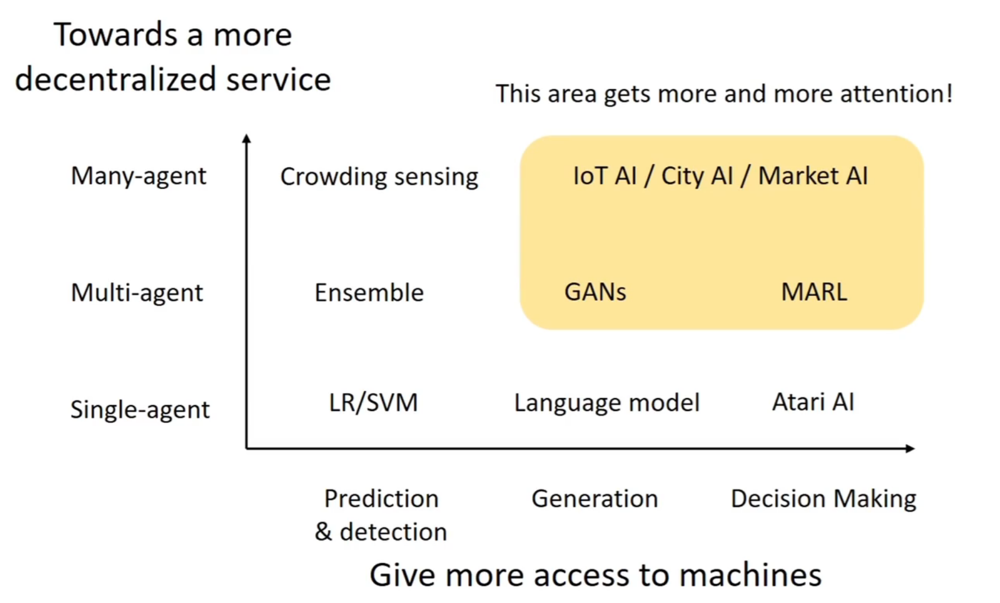
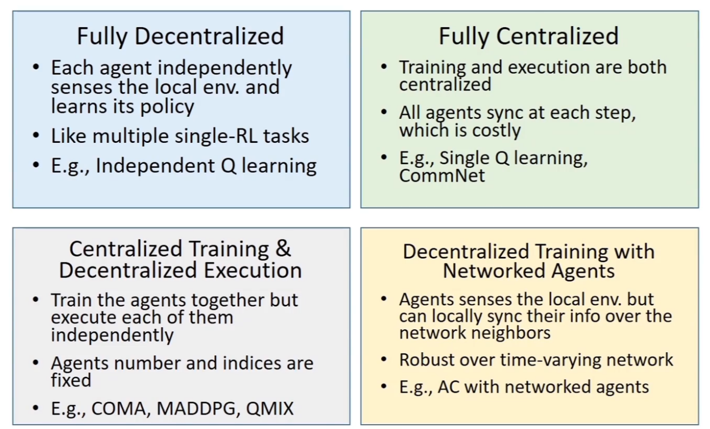
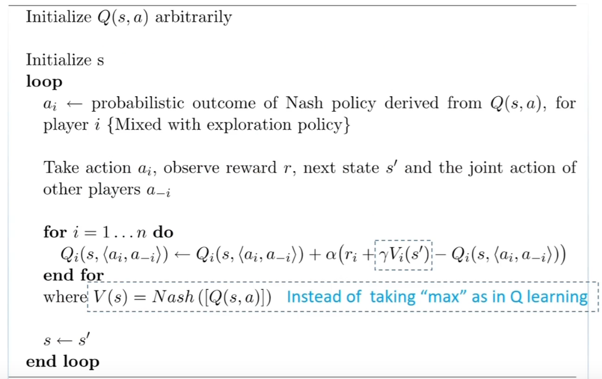
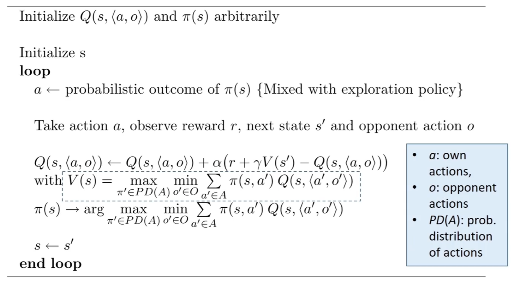
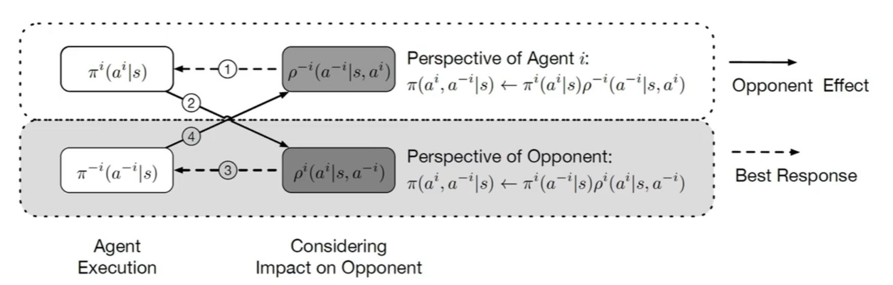
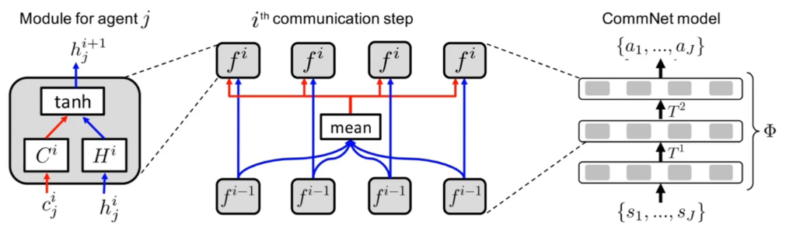
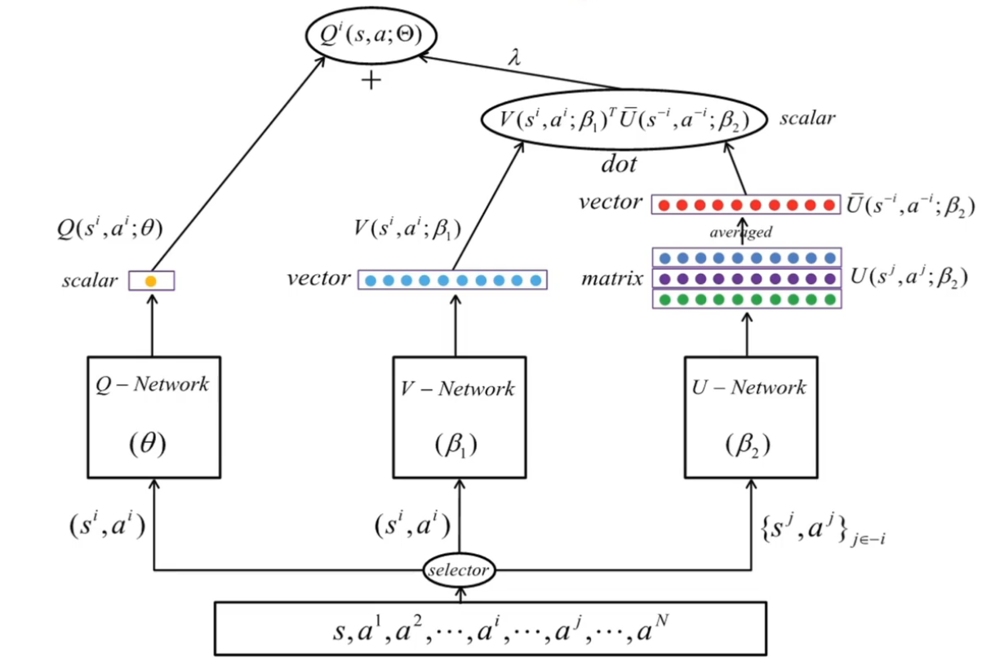

# Multi-Agent RL

## 1 Background of MARL

多智能体强化学习相较于单智能体强化学习有以下几个难点：

- 由于智能体之间的交互导致的环境非稳态问题
- 多智能体的训练多目标的问题
- 训练评估的复杂度增加的问题

多智能体强化学习问题有以下求解范式：

- **完全中心化**：将多个智能体进行决策当作一个超级智能体进行决策，即把所有智能体的状态聚合在一起当作一个全局的超级状态，把所有智能体的动作当作一个联合动作，这样可以恢复环境的稳态，但是不能扩展至智能体很多或者环境很大的情况，同时也有可能导致维度爆炸。
- **完全去中心化**：假设每个智能体都在自身的环境中独立地进行学习，不考虑其他智能体的改变，缺点是环境仍然是非稳态的，但是有比较好的扩展性，不会造成维度灾难。
- **中心化训练去中心化执行（CTDE）**：训练的时候使用一些单个智能体看不到的全局信息以达到更好的效果，执行时不使用这些信息，每个智能体完全根据自己的策略直接动作以达到去中心化执行的效果。

## 2 Multi-Agent Reinforcement Learning

### 2.1 MARL 问题的描述

一个多智能体环境可以用一个元组 $\langle\mathcal{N},\mathcal{S},\mathcal{A},\mathcal{R},\mathcal{P}\rangle$ 建模，其中：

- $\mathcal{N}$ 是所有智能体的数目
- $\mathcal{S}=S_1\times S_2\times S_3\times\dotsb\times S_N$ 是所有智能体的状态集合
- $\mathcal{A}=A_1\times A_2\times A_3\times\dotsb\times A_N$ 是所有智能体的动作集合
- $\mathcal{R}=r_1\times r_2\times r_3\times\dotsb\times r_N$ 是所有智能体的奖励函数的集合
- $\mathcal{P}$ 是环境的状态转移概率

多智能体强化学习的目标是为每个智能体学习一个策略最大化其自身的积累奖励。

对于智能体 $j$，相关策略可以表示为：
$$\pi^j:\mathcal{S}\rightarrow \Omega(A^j)$$

对于所有智能体，联合策略可以表示为：
$$\pi\triangleq[\pi^1,\dotsb,\pi^N]$$

智能体 $j$ 的状态价值函数可以表示为：
$$v_\pi^j(s)=v^j(s;\pi)=\sum_{t=0}^\infty\gamma^t\mathbb{E}_{\pi,p}[r^j_t|s_0=s,\pi]$$

智能体 $j$ 的动作价值函数可以表示为：
$$Q^j_\pi(s,a)=r^j(s,a)+\gamma\mathbb{E}_{s'\sim p}[v_\pi^j(s')]$$

$$a=[a^1,\dotsb,a^N]$$

对 $v_\pi^j(s)$ 的最优化依赖于联合策略 $\pi$，一个特定状态下的纳什均衡可以表示为一个特定的联合策略：
$$\pi_*\triangleq[\pi_*^1,\dotsb,\pi_*^N]$$

在纳什均衡下，没有智能体会主动改变策略：
$$v^j(s;\pi_*)=v^j(s;\pi_*^j,\pi_*^{-j})\geq v^j(s;\pi^j,\pi_*^{-j})$$

对于一个纳什均衡策略，定义一个纳什价值函数：
$$v^{Nash}(s)\triangleq[v_{\pi_*}^1(s),\dotsb,v_{\pi_*}^N(s)]$$

### 2.2 Nash Q-Learning

Nash Q-learning 定义了一个迭代过程：

- 求解由当前的 $Q$ 函数定义的纳什均衡策略 $\pi_*$
- 以新的 Nash 状态价值函数改善对 $Q$ 函数的估计

### 2.3 Minimax Q-Learning

Minimax Q-Learning 考虑到了智能体之间的竞争性博弈：
$$V(s)\triangleq \max_{\pi\in PD(A)}\min_{o'\in O}\sum_{a'\in A}\pi(s,a')Q(s,\langle a',o'\rangle)$$

式子中，以 $\pi$ 表示智能体自身的策略，以 $O$ 表示其他智能体能采取的策略集合，并以最小最大化问题表示智能体之间存在的对抗关系。

### 2.4 Independent Q-Learning

一种完全去中心化的范式，对于每个智能体 $j$，假设其他智能体的策略是固定的，因此环境处于稳态，进而对每个智能体独立进行 Q-learning：
$$Q^j(s,a^j)\leftarrow Q^j(s,a^j)+\alpha(r^j(s,a^j,a^{-j})+\gamma \max_{a^{j'}}Q^j(s',a^{j'})-Q^j(s,a^j))$$

但是由于环境实际上并非稳态，所以该方法的收敛性没有保证。

### 2.5 Independent PPO（IPPO）

IPPO 算法也是一种完全去中心化的算法。对每个智能体使用但智能体算法 PPO 进行训练。

### 2.6 Probabilistic Recursive Reasoning for MARL（PR2）

PR2 是一种基于猜疑链的学习方式，允许每个智能体对其他智能体的决策进行建模，或者说对联合决策进行建模：
$$\pi_\theta(a^i,a^{-i}|s)=\pi_{\theta^i}^i(a^i|s)\pi_{\theta^{-i}}^{-i}(a^{-i}|s,a^i)=\pi_{\theta^{-i}}^i(a^{-i}|s)\pi_{\theta^i}^i(a^i|s,a^i)$$

PR2 的策略目标可以写作：
$$\arg\max_{\theta^i,\phi^{-i}}\eta^i\left(\pi_{\theta^i}^i(a^i|s)\rho^{-i}_{\phi^{-i}}(a^{-i}|s,a^i)\right)$$

策略梯度可以写作：
$$\nabla_{\theta^i}\eta^i\mathbb{E}_{s\sim p,a^i\sim\pi^i}\left[\nabla_{\theta^i}\log\pi_{\theta^i}^i(a^i|s)\int_{a^{-i}}\pi_{\theta^{-i}}^{-i}(a^{-i}|s,a^i)Q^i(s,a^i,a^{-i})\mathrm{d}a^{-i}\right]$$

### 2.7 CommNet

一种中心化的模式，以隐马尔可夫形式维护状态链，并再各智能体之间对全部智能体的状态特征进行平均池化和分发，使得各智能体能够得到部分全局信息。

### 2.8 Multi-Agent DDPG（MADDPG）

MADDPG 方法是一种 CTDE 的算法，对每个智能体实现一个 DDPG 的算法，所有智能体共享一个中心化的critic 网络，该 critic 网络在训练过程中同时对每个智能体的 actor 网络给出指导，执行时每个智能体的 actor 网络则完全独立做出动作，去中心化地执行。

CTDE 的应用场景可以建模为一个部分可观测*马尔科夫博弈*（partially observed Markov game），用 $\mathcal{S}$ 代表全局的状态信息，对于每个智能体 $i$，其动作空间为 $\mathcal{A}_i$，观测空间为 $\mathcal{O}_i$，每个智能体的策略 $\pi_{\theta_i}:\mathcal{O}_i\times\mathcal{A}_i\rightarrow[0,1]$ 是一个概率分布，用来表示智能体在每个观测下采取各个动作的概率。环境的状态转移函数为：$P:\mathcal{S}\times\mathcal{A}_1\times\dotsb\times\mathcal{A}_N\rightarrow\omega(\mathcal{S})$，每个智能体的奖励函数为 $r_i:\mathcal{S}\times\mathcal{A}\rightarrow \mathbf{R}$，每个智能体从全局状态得到的部分观测信息是：$\mathbf{o}_i:\mathcal{S}\rightarrow\mathcal{O}_i$，初始状态分布为 $\rho:\mathcal{S}\rightarrow[0,1]$。每个智能体的优化目标为最大化其期望积累奖励 $R_i=\sum_{t=0}^T\gamma^tr_i^t$。

MADDPG 使用 AC 的方式进行训练，但是不同的是 critic 模块可以获取其他智能体的决策信息，对于有 $N$ 个智能体的博弈，每个智能体的策略参数是 $\theta=\{\theta_1\dotsb,\theta_N\}$，所有智能体的策略集合是 $\pi=\{\pi_1,\dotsb,\pi_N\}$，在随机性策略下每个智能体期望收益的策略梯度是：
$$\nabla_{\theta_i}J(\theta_i)=\mathbb{E}_{s\sim p^\mu,a\sim\pi_i}[\nabla_{\theta_i}\log\pi_i(a_i|o_i)]Q_i^\pi(x,a_i,\dotsb,a_N)$$

$$x=(o_1,\dotsb,o_N)$$

这里的 $Q_i^\pi(x,a_i,\dotsb,a_N)$ 就是一个中心化的动作价值函数。

对于确定性策略，考虑有 $N$ 个连续的策略 $\mu_i$，可以得到 DDPG 的策略更新公式：
$$\nabla_{\theta_i}J(\mu_i)=\mathbb{E}_{x\sim D}[\nabla_{\theta_i}\mu_i(o_i)\nabla_{a_i}Q_i^\mu(x,a_1,\dotsb,a_N)|_{a_i=\mu_i(o_i)}]$$

D 是经验回放池，它存储的每一个数据为 $\langle x,x',a_1,\dotsb,a_N,r_1,\dotsb,r_N\rangle$，在 MADDPG 中，中心化动作价值函数可以按照下面的损失函数进行更新：
$$\mathcal{L}(\omega_i)=\mathbb{E}_{x,a,r,x'}[(Q_i^\mu(x,a_i,\dotsb,a_N)-y)^2]$$

$$y=r_i+\gamma Q_i^{\mu'}(x',a_1',\dotsb,a_N')|_{a_j'=\mu_j'(o_j)}$$

## 3 Many-Agent Reinforcement Learning

海量智能体强化学习主要研究多智能体强化学习问题中，智能体数目极大的情况下的涌现现象。

### 3.1 Mean-Field MARL

平均场多智能体强化学习基于智能体及其邻居互作的方式对 $Q$ 函数进行参数化，并以平均池化的方式对邻居的影响进行混合：
$$Q^j(s,a)=\frac{1}{N^j}\sum_{k\in\mathcal{N}(j)}Q^j(s,a^j,a^k)$$

对于离散的动作空间，智能体 $j$ 的动作可以以 onr-hot vector 编码为：
$$a^j\triangleq[a_1^j,\dotsb,a_N^j]$$

智能体 $j$ 的邻居的平均动作可以被表示为：
$$\bar{a}^{j}=\frac{1}{N^j}\sum_{k\in\mathcal{N}(j)}a^k$$

这实际上可以被看做一种动作分布。

各邻居智能体的动作可以被表示为：
$$a^k=\bar{a}^{j}+\delta a^{j,k}$$

$$\frac{1}{N^j}\sum_{k\in\mathcal{N}(j)}a^{j,k}=0$$

我们可以对 pair wise 的 $Q$ 函数进行二阶的泰勒展开：
$$\begin{aligned}
    Q^j(s,a)&=\frac{1}{N^j}\sum_kQ^j(s,a^j,a^k)\\
    &=\frac{1}{N^j}\sum_k\left[Q^j(s,a^j,\bar{a}^j)+\nabla_{\bar{a}^j}Q^j(s,a^j,\bar{a}^j)\sdot\delta a^{j,k}+\frac{1}{2}a^{j,k}\sdot\nabla_{a^{j,k}}^2Q^j(s,a^j,\bar{a}^{j,k})\sdot a^{j,k}\right]\\
    &=Q^j(s,a^j,\bar{a}^j)+\nabla_{\bar{a}^j}Q^j(s,a^j,\bar{a}^j)\sdot\frac{1}{N^j}\sum_{k\in\mathcal{N(j)}}\delta a^{j,k}+\frac{1}{2N^j}\sum_{k\in\mathcal{N(j)}}\delta a^{j,k}\sdot\nabla_{a^{j,k}}^2Q^j(s,a^j,\bar{a}^{j,k})\sdot \delta a^{j,k}\\
    &=Q^j(s,a^j,\bar{a}^j)+\frac{1}{2N^j}\sum_{k\in\mathcal{N(j)}}R^j_{s,a^j}(a^k)\\
    &\approx Q^j(s,a^j,\bar{a}^j)
\end{aligned}$$

基于 Softmax 形式建立一个 MF-Q 策略：
$$\pi^j_t(a^j|s,\bar{a}^j)=\frac{\exp(-\beta Q^j_t(s,a^j,\bar{a}^j))}{\sum_{a^{j'}\in\mathcal{A^j}}\exp(-\beta Q^j_t(s,a^{j'},\bar{a}^j))}$$

对于一个从缓冲池中采样得到的经验数据 $\langle s,a,r,s',\bar{a}\rangle$ 可以从以 $\phi$ 参数化的智能体 $j$ 的 $Q_{\phi^j}$ 函数中采样得到智能体 $j$ 的下一个动作 $a^j_{next}$，令：
$$y^j=r^j+\gamma Q_{\phi^j}(s',a^j,\bar{a}^j)$$

并以如下的损失函数对 $Q_{\phi^j}$ 进行更新：
$$\mathcal{L}(\phi^j)=(y^j-Q_{\phi^j}(s^j,a^j,\bar{a}^j))^2$$

### 3.2 Factorized Q-Learning

FQL 与 MF-Q 不同之处在于其分离式地考虑独立的 Q 函数和智能体之间的交互。

