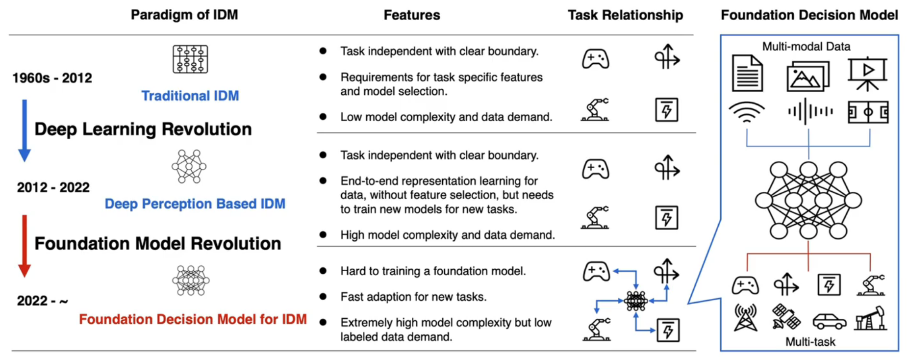
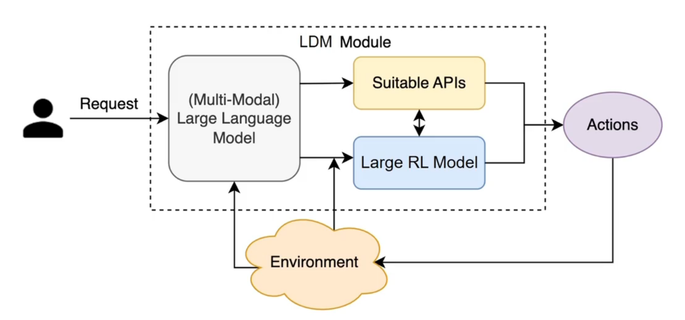
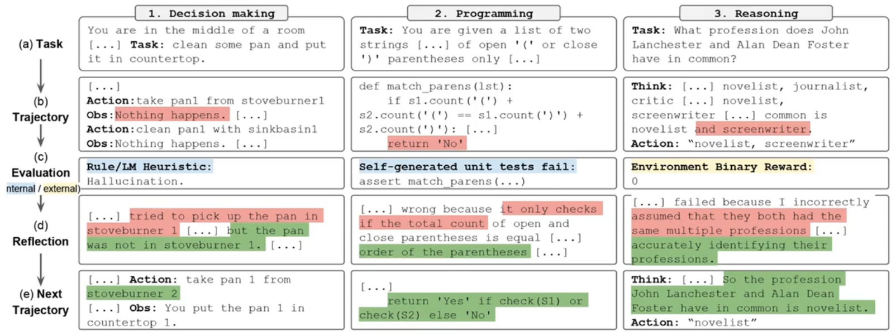
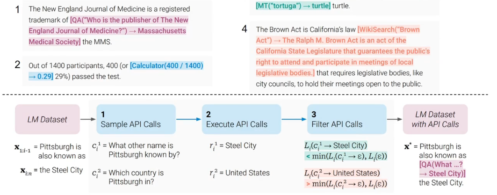
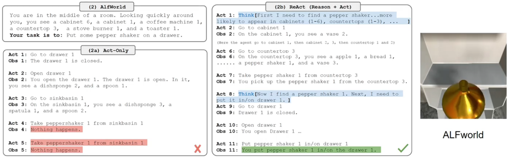
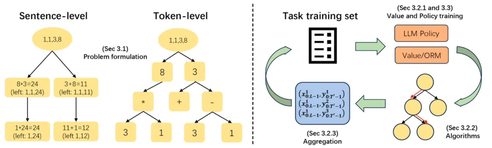
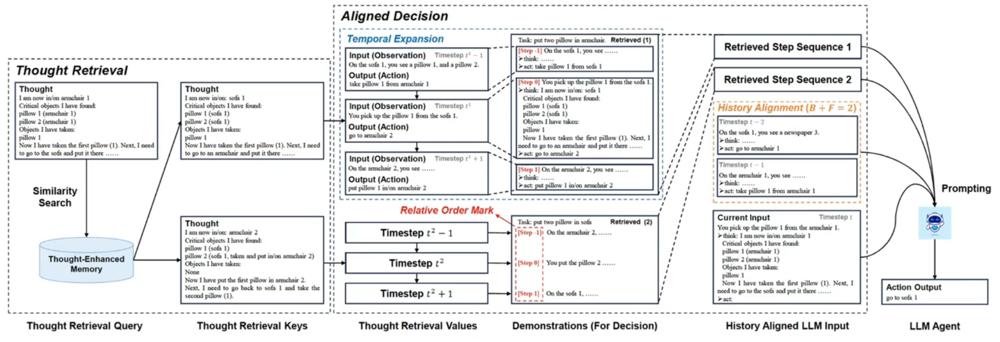
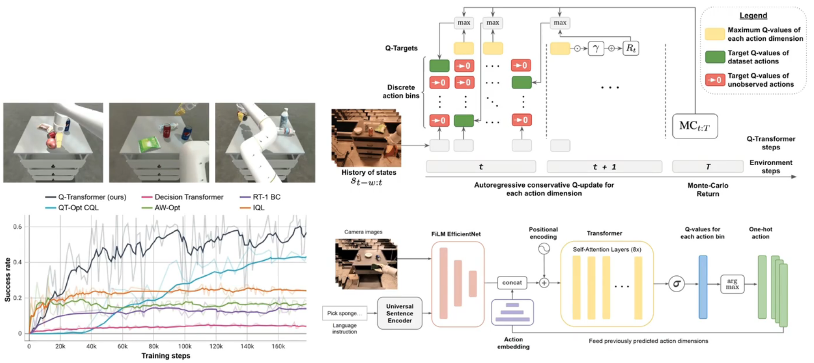

# Agent and LLM

## 1 面向智能决策（Intelligent Decision-Making）的基础模型

面向智能决策的模型旨在使用大模型解决决策任务中的环境变化、开放环境、策略泛化的问题。

决策大模型有两种范式：

- LLM Agent：以大语言模型为中心，配合 API 选择的决策
- Large RL Models：以强化学习大模型为中心，做底层的决策控制

## 2 LLM Agent

### 2.1 Reflexion

反思代理对任务反馈信号进行口头反思，然后将自己的反思文本保存在外显记忆缓冲区中，以便在后续试验中做出更好的决策。

### 2.2 Toolformer

Toolformer 可自主决定调用不同的应用程序接口，以获取对完成文本有用的信息。

### 2.3 ReAct

基于思维（智能体内部产生的信号，不直接影响交互环境）和当前状态，智能体产生对应的动作，进而更好地完成任务，主要范式是思维链（Chain-of-Thought）和思维树（Tree-of-Thought）。

### 2.4 LLM-TS

将句子或者 token 看成思维空间中的节点，由此就可以在认知空间中进行 MCTS：

- 训练每个节点的价值评估函数
- 此价值函数可以更好地指导大语言模型策略做训练和动作执行

### 2.5 TRAD

使用历史中类似的成功轨迹数据，在思维链过程中检索类似的思维点，并对齐 Agent 在轨迹上的动作，以增强 LLM Agent 在目前步应该采取的动作性能。

## 3 Large RL Models

### 3.1 Goal-Conditioned RL（GCRL）

在 MDP 环境中额外定义一个目标，将此目标显式地告诉智能体，并在训练过程中使用此目标信息，进而在测试阶段给定新的目标，使得智能体能够通过直接泛化解决新的任务。

### 3.2 Q-Transformer

将动作逐位离散化，然后使用 Transformer 建模 $Q(s_{t-\omega:t},a_t^{1:i-1},a^i_t)$：
$$Q(s_{t-\omega:t},a_t^{1:i-1},a^i_t)\leftarrow\begin{cases}
    \max_{a_t^{i+1}}Q(s_{t-\omega:t},a_t^{1:i},a^{i+1}_t)&if~~~i\in\{1,\dotsb,d_\mathcal{A}-1\}\\
    R(s_t,a_t)+\gamma\max_{a_{t+1}^1}Q(s_{t-\omega+1:t+1},a_{t+1}^1)&if~~~i=d_\mathcal{A}\\
\end{cases}$$

