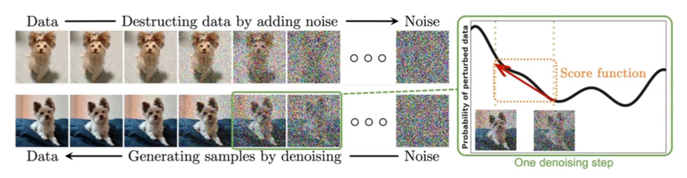
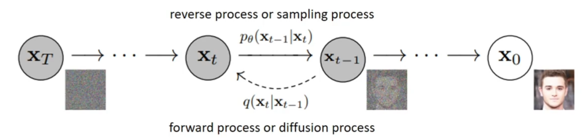
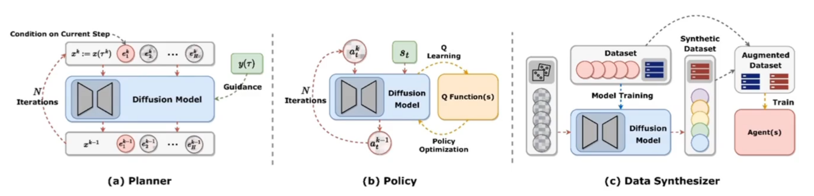
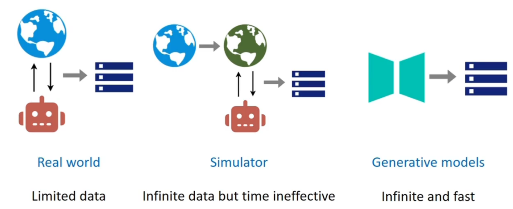
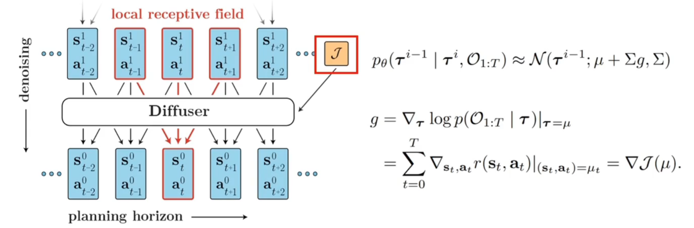
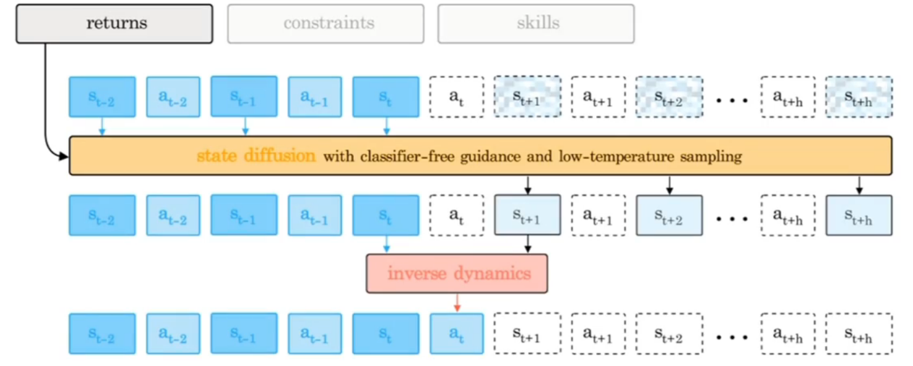

# Diffusion Models for RL

## 1 Challenges for RL

- 离线强化学习的表达能力有限
- 经验回放中的数据稀缺
- 基于模型的 planning 中的复合误差

这三点挑战分别对应于 diffusion policy、diffusion augmentation、diffusion planning。

## 2 Fundamental Knowledge for DDMP

DDPM 由逐渐向原始数据中增加噪声的前向过程和逐渐从噪声中恢复原始数据的反向过程组成：
$$p_\theta(x_0)=\int p(x_T)\prod_{t=1}^T p_\theta(x_{t-1}|x_t)\mathrm{d}x_{1:T},p(x_T)=\mathcal{N}(0,I)$$

$$q(x_t|x_{t-1})=\mathcal{N}(\alpha_t x_{t-1},\sqrt{1-\alpha_t}I)$$

$$x_t=\sqrt{\bar{a}_t}x_0+\sqrt{1-\bar{a}_t}\epsilon,\epsilon\sim\mathcal{N}(0,1),\bar{a}_t\coloneqq\prod^t_{s=1}a_s$$

在迭代的去噪过程中，每一次 DDPM 均采用以下的方式恢复出上一个时间步的数据：
$$x_{t-1}=\frac{1}{\sqrt{\alpha_t}}\left(x_t-\frac{1-\alpha_t}{\sqrt{1-\bar{\alpha}_t}}\epsilon_\theta(x_t,t)\right)+\sigma_tz$$

DDPM 可以被用于条件生成，在这种情况下，模型从一个条件概率分布 $p(x|y)$ 采样，而不是从边缘概率分布 $p(x)$ 采样.

条件生成过程可以写作：
$$p_{\theta,\phi}(x^{t-1}|x^t,y)=\mathcal{Z}p_\theta(x^{t-1}|x^t)p_\phi(y|x^{t-1})$$

其中 $\mathcal{Z}$ 是归一化因子。

反向过程可以以另一个高斯分布近似：
$$p_{\theta,\phi}(x^{t-1}|x^t,y)=\mathcal{N}(\mu^t+\omega\Sigma^tg,\Sigma^t)$$

其中 $g=\nabla_{x^t}\log p_\phi(y|x^t)|_{x^t=\mu^t}$，有两种方式处理：

- 使用一个额外的分类器的梯度，即有监督学习的范式
- 使用 FBM 和 Langevin 动力学的方式近似，即无监督学习的范式：
  $$\epsilon(x^t,t)=-\sigma_t\nabla_{x^t}\log p(x^t)$$

  $$\nabla_{x^t}\log p(y|x^t)=-\frac{1}{\sigma_t(\epsilon(x^t,y,t)-\epsilon(x^t,t))}$$

  $$\hat{\epsilon}_\omega(x^t,y,t)=\omega\epsilon_\theta(x^t,y,t)+(1-\omega)\epsilon_\theta(x^t,t)$$

## 3 Roles of DDPM

### 3.1 Diffusion Planner

DDPM 作为 planner 在决策维度上不存在自回归结构，因此没有传统 planner 的复合误差问题。

### 3.2 Diffusion Data Synthesizer

DDPM 作为生成式模型，可以产生大量高质量数据以提升智能体性能。

### 3.3 Other Usages

- Value functions：使用 diffusion 模型作为价值函数（DVF）
- Latent representations：使用 diffusion 模型产生轨迹的隐空间嵌入（LDCQ）
- Dynamics models：使用 diffusion 模型建立动态的环境模型，配合在线强化学习算法（PolyGRAD）
- Reward functions：从 diffusion 模型中提取奖励函数

## 4 Applications of DMs for RL

### 4.1 Diffuser

使用单独训练的分类器进行条件控制，通过迭代式地去噪过程生成最优的轨迹数据。

### 4.2 Decision Diffuser

Decision Diffuser 使用无分类器的条件控制生成范式，仅生成状态序列数据，然后通过单独的反向动态网络恢复动作。

