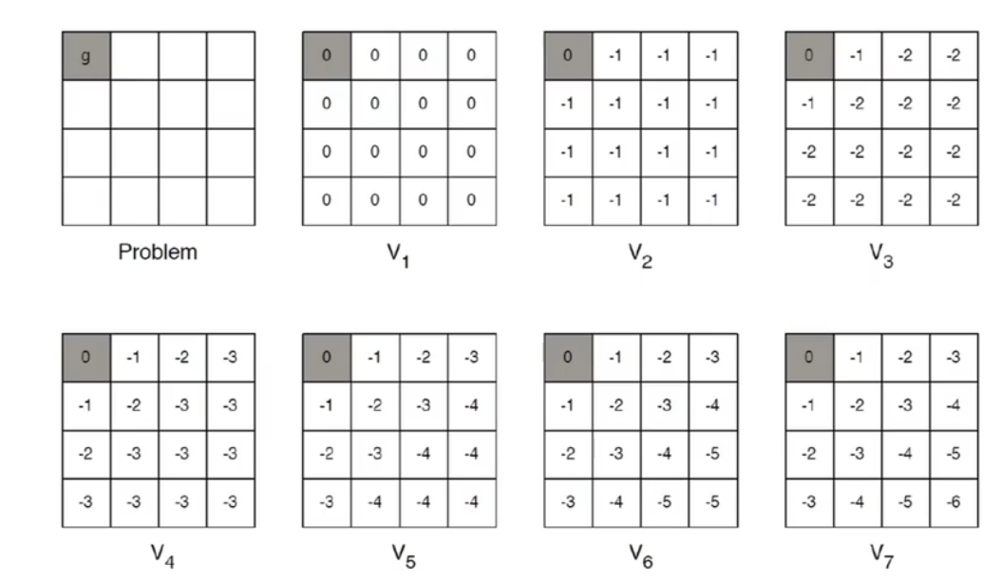

# RL Based on Dynamic Programing

基于动态规划的强化学习算法包括两种，策略迭代和价值迭代：

- 策略迭代中的策略评估使用贝尔曼期望方程得到一个策略的状态价值函数
- 价值迭代则直接使用贝尔曼最优方程进行动态规划，得到最终的最优状态价值值函数

不同于蒙特卡洛方法和时序差分方法，这两种算法需要事先知道环境的状态转移函数和奖励函数，也就是需要知道整个 MDP 过程。因此，**动态规划算法只能适用于白盒环境**。

此外，动态规划算法**只适用于有限 MDP**，即状态空间和动作空间是有限且离散的。

## 1 策略迭代算法

策略迭代是策略评估和策略提升不断循环交替，直至最后得到最优策略的过程。

### 1.1 策略评估

正如前述的贝尔曼期望方程：
$$V^\pi(s)=\sum_{a\in A}\pi(a|s)\left[r(s,a)+\gamma \sum_{s'\in S}P_{s\pi(s)}(s')V^{\pi}(s')\right]$$

根据动态规划的思想，可以把计算下一个可能的状态的价值当作一个子问题，把计算当前状态的价值当作当前问题：
$$V^{k+1}=\sum_{a\in A}\pi(a|s)\left[r(s,a)+\gamma \sum_{s'\in S}P_{s\pi(s)}(s')V^{k}(s')\right]$$

可以选定任意初始值 $V_0$，并根据以上的迭代公式求解当前策略下的价值函数。

根据贝尔曼期望方程，$V^{k+1}=V^{\pi}$ 是以上更新公式的一个*不动点*（fixed point），当 $k\rightarrow\infty$ 时，序列 $\{V^k\}$ 会收敛至 $V^{\pi}$。

可见，由于需要不断计算贝尔曼期望方程，策略评估的计算代价很大。

### 1.2 策略提升

根据策略提升定理，在策略迭代的第 $n$ 轮，使用这样的方式对策略进行更新：
$$\pi'(s)=\arg\max_a Q^\pi(s,a)=\arg\max_a\{r(s,a)+\gamma\sum_{s'}P(s'|s,a)V^n(s')\}$$

当策略提升之后得到的策略与之前的策略一样时，策略迭代达到了收敛，此时的策略即为最优策略。

策略迭代的一个缺陷是，每次迭代的过程中都需要在策略评估收敛之后再进行策略提升，但是实际上在策略评估完全收敛之前进行策略提升也有可能有效地优化策略。

## 2 价值迭代

价值迭代可以被看作是一种策略评估只进行了一轮的策略迭代算法。

价值迭代中不存在显示的策略，我们只能维护一个状态价值函数。

确切地来说，价值迭代可以被看做一种动态规划过程，它利用贝尔曼最优方程：
$$V^*(s)=\max_{a\in A}{r(s,a)+\gamma\sum_{s'\in S}P(s'|s,a)V^*(s')}$$

其迭代形式为：
$$V^{k+1}(s)=\max_{a\in A}{r(s,a)+\gamma\sum_{s'\in S}P(s'|s,a)V^{k}(s')}$$

注意到在该迭代式中并不存在policy的定义，式子中的 $V^*(s)$ 并不对应任何具体策略之下的价值，而是一个普遍的中间变量。在每一轮迭代中，agent并不会依据随机的策略行动，而是直接选择最优解。

价值迭代按照以上模式进行，直到 $V^{k+1}=V^{k}$ 时，达到贝尔曼最优方程的不动点，此时对应最优状态价值函数 $V^*(s)$，然后从中恢复出最优策略即可：
$$\pi^*(s)=\arg\max_a\{r(s,a)+\gamma\sum_{s'}P(s'|s,a)V^*(s')\}$$

在价值迭代未收敛时得到的V table可能并不与合法的policy对应，但是在价值迭代收敛之后，就一定存在最优策略与之对应。

## 3 价值迭代和策略迭代的对比

- 价值迭代是一种贪心算法
- 策略迭代中的每一个中间状态都对应一种合法的策略，而价值迭代则并非如此
- 策略迭代中，用Bellman equation更新价值函数代价较大
- 对于空间较小的 MDP，策略迭代通常很快收敛，且更加精准
- 对于空间较大的 MDP，价值迭代效率更高
- 如果没有状态转移循环，最好使用价值迭代

## 4 基于模型的强化学习

在以上的优化策略中，状态转移和奖励函数均明确给定，但在实际问题中，状态转移函数和奖励函数一般不会明确给出，我们只能观测到 agent 与环境交互产生的 episodes 数据。

那么一种可能的方式是通过建立模型学习状态转移概率 $P_{sa}(s')$ 和奖励函数 $r(s)$，从而将问题转化为白盒规划问题。

算法可以简单概括为：

- 随机初始化策略
- 使用策略采样，收集经验数据
- 对状态转移和奖励函数进行经验估计
- 使用策略迭代或价值迭代对策略进行更新
- 使用更新之后的策略重复上述过程，直至收敛

但是模型 MDP 和真实环境之间的差距会在迭代的过程中显著放大，以至于最终策略远离真实最优点。

另一种解决方案是不学习 MDP，从经验中直接学习价值函数和策略，即无模型的强化学习（Model-free Reinforcement Learning）。
