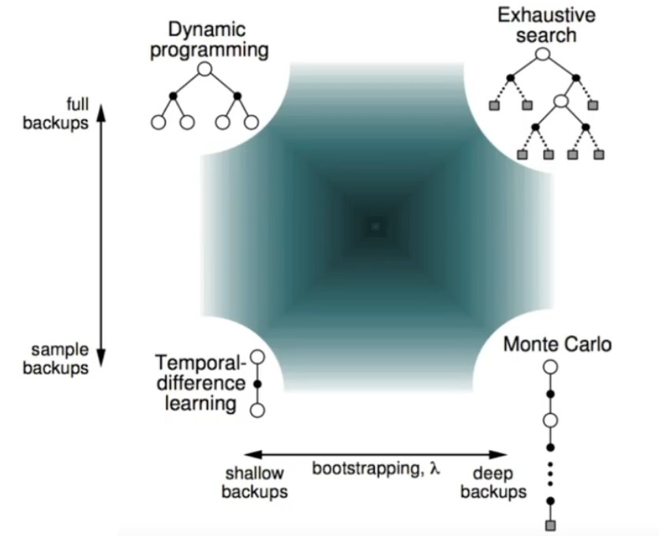

# Value Function Summation

在无模型的强化学习中，我们无法直接解析 $P_{sa}$ 和 $r$，但是我们有一系列用于值函数 $V^\pi(s)$ 估计的经验数据。

## 1 Monte-Carlo Methods

蒙特卡洛方法是一种基于概率统计的数值计算方法，运用蒙特卡洛方法时，我们通常需要重复随机采样，然后运用概率统计方法从抽样结果中归纳出我们想要得到的目标的数值估计。

使用蒙特卡洛方法估计状态的价值的思路十分简单，因为一个状态的价是其期望回报，那么只需要使用特定的策略在 MDP 上采样大量序列，计算从该状态出发的回报并求均值即可：
$$V^\pi(s)=\mathbb{E}_\pi[G_t|S_t=s]\approx\frac{1}{N}\sum_{i=1}^NG_t^{(i)}$$

实际上可以使用增量更新方式：
$$N(s_t)\leftarrow N(s_t)+1$$
$$V(s_t)\leftarrow V(s_t)+\frac{1}{N(s_t)}(g_t-V(s_t))$$

对于环境随时间变化的非稳定问题，可以跟踪一个现阶段的平均值：
$$V(s_t)\leftarrow V(s_t)+\alpha(g_t-V(s_t))$$

其中 $\alpha$ 表示更新步长。

使用蒙特卡洛方法计算状态价值的一般过程是：

- 使用策略 $\pi$ 采样若干条序列
- 对每条序列中每个时间步 $t$ 的状态 $s$ 进行以下操作：
  - 更新状态 $s$ 的计数器：
    $$N(s)\leftarrow N(s)+1$$
  - 更新状态 $s$ 的总回报：
    $$M(s)\leftarrow M(s)+G$$
- 每一个状态 $s$ 的价值被估计为回报的期望：
    $$V(s)=M(s)/N(s)$$
- 或者使用增量更新的方式：
    $$N(s)\leftarrow N(s)+1$$
    $$V(s)\leftarrow V(s)+\frac{1}{N(s)}(G-V(s))$$

蒙特卡洛方法有以下特点：

- 直接从完整的经验片段中学习，不使用bootstrapping方法
- 模型无关
- **只应用于有限长度的 MDP 中**
- 需要大量的采样数据。否则会造成大方差

## 2 重要性采样

### 2.1 重要性采样的定义

重要性采样是一种基于已有的数据估计不同分布下期望的方式：

$$\begin{aligned}
    \mathbb{E}_{x\sim p}[f(x)]&=\int_x p(x)f(x)dx\\
    &=\int_x q(x)\frac{p(x)}{q(x)}f(x)dx\\
    &=\mathbb{E}_{x\sim q}\left[\frac{p(x)}{q(x)}f(x)\right]
\end{aligned}$$

我们将每个实例的权重重新分配为 $\beta(x)=\frac{p(x)}{q(x)}$，$\beta$ 称为*重要性比率*（importance ratio）。

使用重要性采样的一个风险是某些情况下importance ratio可能会过大，从而导致高方差（variance）。

### 2.2 使用重要性采样的离线策略蒙特卡洛

使用策略 $\mu$ 产生的累积奖励评估策略 $\pi$。

根据两个策略之间的重要性比率对累计奖励 $g_t$ 加权。

每个episode乘以重要性比率：
$$[s_1,a_1,r_1,s_2,a_2,r_2,\dotsb,s_T]\sim\mu$$

$$g_t^{\pi/\mu}=\frac{\pi(a_t|s_t)\pi(a_{t+1}|s_{t+1})\dotsb\pi(a_T|s_T)}{\mu(a_t|s_t)\mu(a_{t+1}|s_{t+1})\dotsb\mu(a_T|s_T)}g_t$$

更新值函数以逼近修正的累计奖励值：
$$V(s_t)\leftarrow V(s_t)+\alpha\left(g_t^{\pi/\mu}-V(s_t)\right)$$

该方法不能在 $\pi$ 非零而 $\mu$ 为零时使用，同时这种连乘形式的重要性比率会引起重要性采样显著增加方差。

### 2.3 使用重要性采样的离线策略时序差分

使用策略 $\mu$ 产生的时序差分目标评估策略 $\pi$。

根据重要性采样对时序差分目标 $r+\gamma V(s')$ 加权。

仅需要一步来进行重要性采样修正：
$$V(s_t)\leftarrow V(s_t)+\alpha\left(\frac{\pi(a_t|s_T)}{\mu(a_t|s_T)}(r_t+\gamma V(s_{t+1}))-V(s_t)\right)$$

由于该方法中策略仅需在单步中被近似，重要性比率仅涉及一步的策略而没有类似重要性采样蒙特卡洛的连乘形式，因此具有**比蒙特卡洛重要性采样更低的方差**。

## 3 时序差分学习（Temporal Difference Learning）

### 3.1 时序差分学习的定义

时序差分结合了蒙特卡洛和动态规划的思想，时序差分方法和蒙特卡洛的相似之处在于可以从样本数据中学习，不需要事先知道环境；和动态规划的相似之处在于可以根据贝尔曼方程的思想，利用后续状态的价值估计来更新当前状态的价值估计。

时序差分的更新规则是：

$$V(s_t)\leftarrow V(s_t)+\alpha[r_t+\gamma V(s_{t+1})-V(s_t)]$$

其中，$r_t+\gamma V(s_{t+1})-V(s_t)$ 通常被称为时序差分误差，时序差分将其与步长 $\alpha$ 的乘积作为状态价值的更新量。可以使用其代替 $g_t$ 的原因是：
$$\begin{aligned}
    V^\pi(s)&=\mathbb{E}_\pi[G_t|S_t=s]\\
    &=\mathbb{E}_\pi[\sum_{k=0}^\infty\gamma^kR_{t+k}|S_t=s]\\
    &=\mathbb{E}_\pi[R_{t+k}+\sum_{k=0}^\infty\gamma^kR_{t+k+1}|S_t=s]\\
    &=\mathbb{E}_\pi[R_{t+k}+\gamma V^\pi(S_{t+1})|S_t=s]\\
\end{aligned}$$

与蒙特卡洛对比可以看到，时序差分学习使用 $r_t+\gamma V(s_{t+1})$ 替换了 $g_t ^{\pi/\mu}$，因此只需要使用一步的观测数据 $r_t$ 和一个对未来的猜测 $V(s_{t+1})$，而无需使用全部的序列数据。

但是时序差分使用更新目标即价值函数 $V(s)$ 本身估计更新目标，因此估计过程是有偏的，这是一个以 bias 交换 variance 的过程。

时序差分学习算法有以下特点：

- 直接从经验片段中学习
- 模型无关，无需预先获取马尔可夫决策过程的状态转移/奖励
- 通过**bootstrapping**，时序差分可以**从不完整的片段中学习**
- 时序差分更新当前预测值使之接近估计累计奖励（非真实值）

### 3.2 蒙特卡洛与时序差分的比较

- 时序差分能够在每一步之后进行在线学习，蒙特卡洛必须等待片段结束，直到奖励已知
- 时序差分能够从不完整的序列中学习，蒙特卡洛只能从完整序列中学习
- 时序差分在连续的环境下工作，而蒙特卡洛只能在片段化的环境下工作
- 蒙特卡洛有更低的误差，时序差分有更低的方差
- 蒙特卡洛具有更良好的收敛性质，且对初始值不敏感

### 3.3 多步时序差分学习

多步时序差分学习是对蒙特卡洛和单步时序差分的一种调和。

定义 $n$ 步累积奖励：
$$g^{(n)}_t=r_t+\gamma r_{t+1}+\dotsb+\gamma^{n-1}r_{t+n-1}+\gamma^nV(s_{t+n})$$

$n$ 步时序差分的更新机制是：
$$V(s_t)\leftarrow v(s_t)+\alpha(g_t^{(n)}-V(s_t))$$

