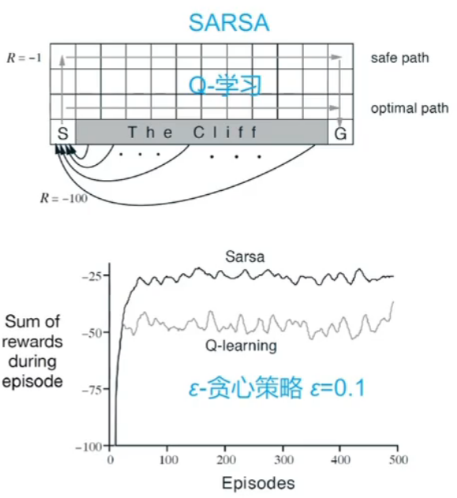
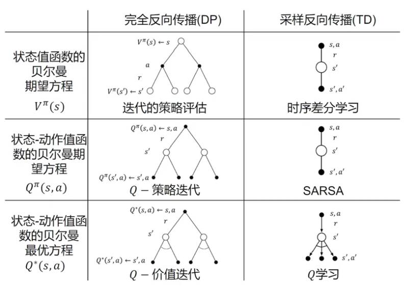
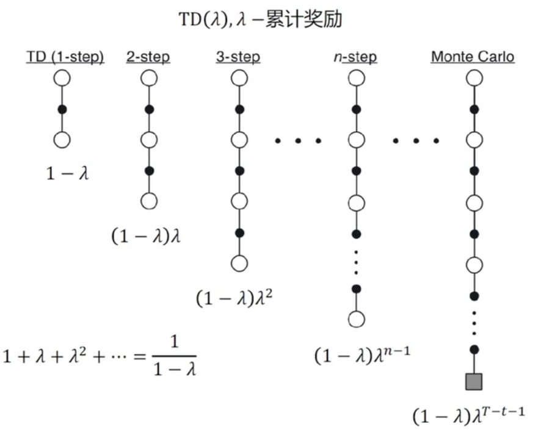
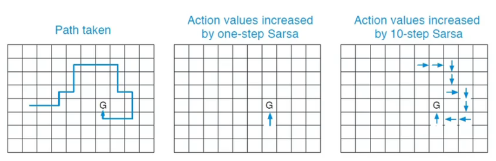
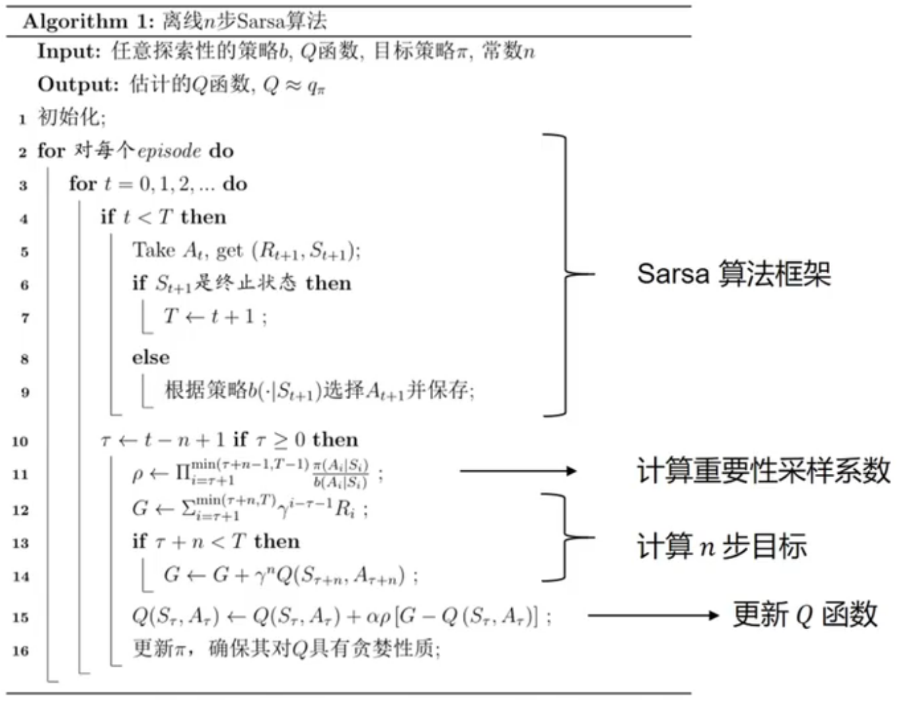
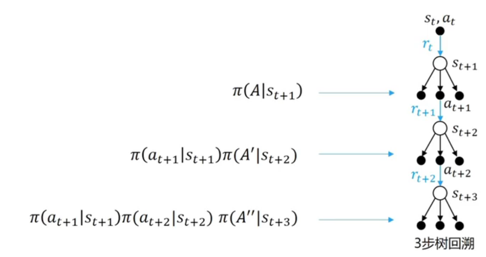

# Model Free Adaptive Control

## 1 SARSA 算法

通过时序差分，我们可以在不使用状态转移概率和奖励函数的情况下进行策略评估，那么如何在这种情况下进行策略提升呢？答案是可以使用时序差分对动作价值函数进行估计：
$$Q(s_t,a_t)\leftarrow Q(s_t,a_t)+\alpha[r_t+\gamma Q(s_{t+1},a_{t+1})-Q(s_t,a_t)]$$

然后使用贪婪策略选择在某个状态下动作价值最大的那个动作，即：$\arg\max_a Q(s,a)$

概括来说，SARSA算法分为两个步骤：

- 用贪婪算法根据动作价值选取动作与环境交互
- 根据得到的数据用时序差分算法更新动作价值估计

这个算法需要解决的问题是：

- 如果使用时序差分来准确估计策略的状态价值函数，我们需要用极大量的样本来进行更新；这个问题通过直接使用一些样本进行策略评估，然后进行更新的方式实现，类似于以价值迭代代替策略迭代。
- 如果在策略提升中一直使用贪婪算法得到一个确定性策略，可能会导致某些状态动作对 $(s,a)$ 永远没有在序列中出现，以至于无法对其动作价值函数进行估计，进而无法保证策略提升之后的策略比之前的好；常见的解决方法是。

SARSA和一般过程是：

- 随机初始化 $Q(s,a)$
- 采样 $E$ 条序列，在每次采样时
  - 取得一个初始状态
  - 使用ε-贪婪策略根据 $Q$ 选择当前状态 $s'$ 下的动作 $a'$
  - 对于每个时间步 $t=1\rightarrow T$：
    - 得到环境反馈的 $r$、$s'$
    - 用ε-贪婪策略根据 $Q$ 选择当前状态 $s'$ 下的 $s'$ 下的动作 $a'$
    - 更新 $Q$ Table：
    $$Q(s_t,a_t)\leftarrow Q(s_t,a_t)+\alpha[r_t+\gamma Q(s_{t+1},a_{t+1})-Q(s_t,a_t)]$$
    - $s\leftarrow s'$，$a\leftarrow a'$

## 4 Q-learning

Q-learning 是另一种基于时序差分的强化学习算法，其与SARSA最大的区别是其动作价值函数更新方式为：
$$Q(s_t,a_t)\leftarrow Q(s_t,a_t)+\alpha[r_t+\gamma \max_aQ(s_{t+1},a)-Q(s_t,a_t)]$$

Q-learning 的具体学习过程如下：

- 随机初始化 $Q(s,a)$
- 采样 $E$ 条序列，在每次采样时
  - 取得一个初始状态
  - 确定一个策略 $\pi(·|S_t)$
  - 对于每个时间步 $t=1\rightarrow T$：
    - 得到环境反馈的 $r$、$s'$
    - 用策略 $\pi(·|S_t)$ 选择当前状态 $s'$ 下的 $s'$ 下的动作 $a'$
    - 更新 $Q$ Table：
    $$Q(s_t,a_t)\leftarrow Q(s_t,a_t)+\alpha[r_t+\gamma \max_aQ(s_{t+1},a)-Q(s_t,a_t)]$$
    - $s\leftarrow s'$，$a\leftarrow a'$

可以以价值迭代的角度理解 Q-learning，即 Q-learning 是对最优动作价值函数的直接估计：
$$Q^*(s,a)=r(s,a)+\gamma\sum_{s'\in \mathcal{S}P(s'|s,a)}\max_{a'\in\mathcal{A}}Q^*(s',a')$$

Q-learning 的收敛性可以被严格证明。

---
**[同策略算法与异策略算法]**

我们称采样数据的策略为*行为策略*（behavior-policy），称用这些数据来更新的策略为*目标策略*（targer-policy）。

*同策略*（on-policy）算法表示行为策略和目标策略是同一个策略；而*异策略*（off-policy）算法表示行为策略和目标策略不是一个策略。

- 对于 SARSA，它的更新公式依赖于 $\langle s,a,r,s',a'\rangle$，因此它是同策略学习算法；
- 对于 Q-learning，它的更新公式使用四元组 $\langle s,a,r,s'\rangle$，该四元组不一定是根据当前策略采样得到的数据，也可以来自行为数据，因此是异策略算法。

使用离线策略学习的原因：

- 平衡探索和利用
- 通过观察人类或其他智能体学习策略
- 重用旧策略产生的经验
- 遵循探索策略时学习的最优策略
- 遵循一个策略时学习多个策略

使用离线策略学习可以杜绝使用重要性采样，但是不应当使用两个差距过大的策略作为目标策略和行为策略。

---
在Q-learning中允许行为策略和目标策略均进行改进：

- 目标策略是关于 $Q(s,a)$ 的贪心策略：
  $$\pi(s_{t+1})=\arg\max Q(s_{t+1},a')$$
- 行为策略是关于 $Q(s,,a)$ 的 ε-greedy 策略

## 3 多步时序差分

蒙特卡洛和时序差分算法之间的区别是，前者是无偏的，但是具有比较大的方差，因为每一步转移都具有不确定性，而每一步状态采取的动作所得到的不一致的奖励会累加起来，这会极大影响最终的价值估计；而时序差分算法具有非常小的方差，因为只关注了一步状态转移，用到了一步奖励，但是它是有偏的，因为用到了下一个状态的价值估计而不是真实的价值。

多步时序差分是对是对蒙特卡洛和时序差分的一种折衷，将：
$$G_t=r_t+\gamma Q(s_{t+1},a_{t+1})$$

替换为：
$$G_t=r_{t}+\gamma r_{t+1} + \gamma^2 r_{t+2} +\dotsb+\gamma^n Q(s_{t+n},a_{t+n})$$

## 4 TD(λ) 算法与多步 SARSA

TD学习是一种结合了蒙特卡洛方法和动态规划优点的强化学习方法，它能够在不依赖完整事件序列的情况下更新价值函数估计。TD(λ)通过引入参数λ，提供了一种介于一步更新（如TD(0)）和蒙特卡洛方法之间的折中方案。

- 当λ=0时，TD(λ)等同于TD(0)，即一般的时序差分算法，只使用单步预测进行更新；
- 当λ=1时，TD(λ)类似于蒙特卡洛方法，考虑从当前状态到事件结束的所有奖励。

于是，存在一种多步SARSA算法，将动作价值函数的更新方式：
$$Q(s_t,a_t)\leftarrow Q(s_t,a_t)+\alpha[r_t+\gamma Q(s_{t+1},a_{t+1})-Q(s_t,a_t)]$$

替换为：
$$Q(s_t,a_t)\leftarrow Q(s_t,a_t)+\alpha[g_{t:t+n}-Q(s_t,a_t)],n\geq1,0\leq t<T-n$$

其中：
$$g_{t:t+n}=r_t+\gamma r_{t+1} + \gamma^2 r_{t+2} +\dotsb+\gamma^n Q(s_{t+n},a_{t+n}),0\leq t<T-n$$

多步 SARSA 在稀疏的任务中尤其具有优势。

不同于SARSA，不存在多步的 Q-learning 算法。

## 5 多步异策略学习

对于多步的异策略学习方法，最关键的一点就是利用重要性采样比 $\rho_{t:h}$：
$$\rho_{t:t+n-1}=\prod_{k=t}^{\min (t+n-1,T-1)}\frac{\pi(A_k|S_k)}{b(A_k|S_k)}$$

$$V(s_t)\leftarrow V(s_t)+\alpha\rho_{t:t+n-1}[g_t^{(n)}-V(s_t)]$$

$$Q(s_t,a_t)\leftarrow Q(s_t,a_t)+\alpha \rho_{t:t+n-1}[g_t^{(n)}-Q(s_t,a_t)]$$

使用多步异策略学习有以下影响：

- 数据的使用效率增加
- variance 增加

## 6 多步树回溯算法（N-step Tree Backup Algorithm）

多步树回溯算法是一种避免使用重要性采样的多步异策略算法。

对于 $n=1$：
$$g_{t:t+1}=r_t+\gamma\sum_a\pi(a|s_t+1)Q(s_{t+1},a)$$

对于 $n=2$：
$$\begin{aligned}
  g_{t:t+2}&=r_t+\gamma\sum_{a\not ={a_{t+1}}}\left(r_{t+1}+\gamma\sum_a\pi(a|s_{t+2})Q(s_t+2,a)\right)\\
  &=r_t+\gamma\sum_{a\not ={a_{t+1}}}\pi(a|s_{t+1})Q(s_{t+1},a)+\gamma\pi(a_{t+1}|s_{t+1})g_{t+1:t+2}
\end{aligned}$$

对于 $n$ 步的情况：
$$g_{t:t+n}=t_t+\gamma\sum_{a\not ={a_{t+1}}}\pi(a|s_{t+1})Q(s_{t+1},a)+\gamma\pi(a_{t+1}|s_{t+1})g_{t+1:t+n}$$

$$Q(s_t,a_t)\leftarrow Q(s_t,a_t)+\alpha(g_{t:t+n}-Q(s_t,a_t))$$
