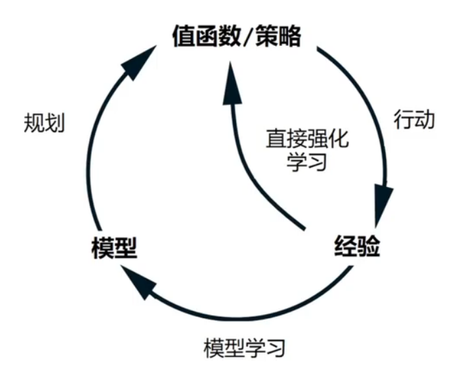
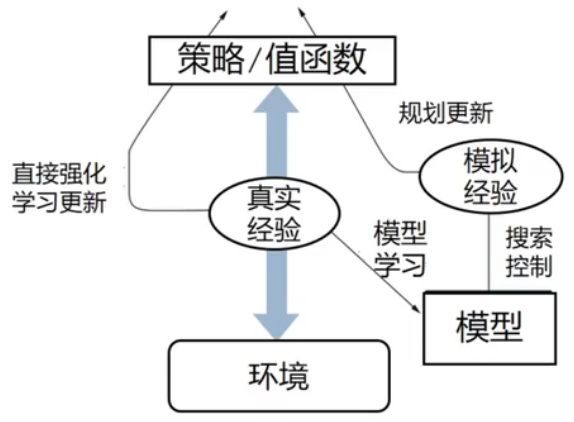
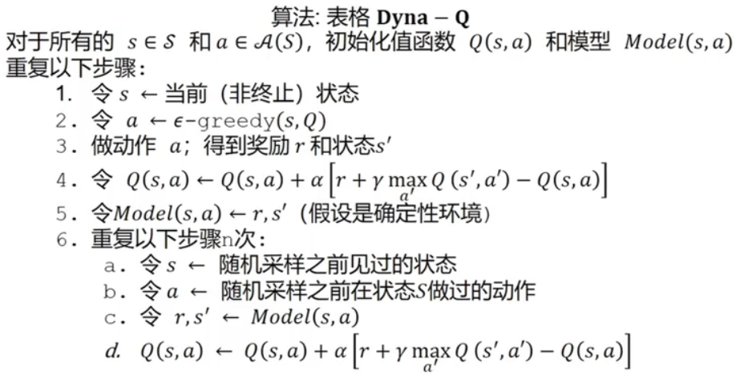
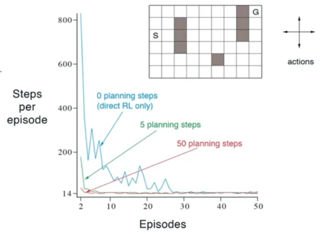
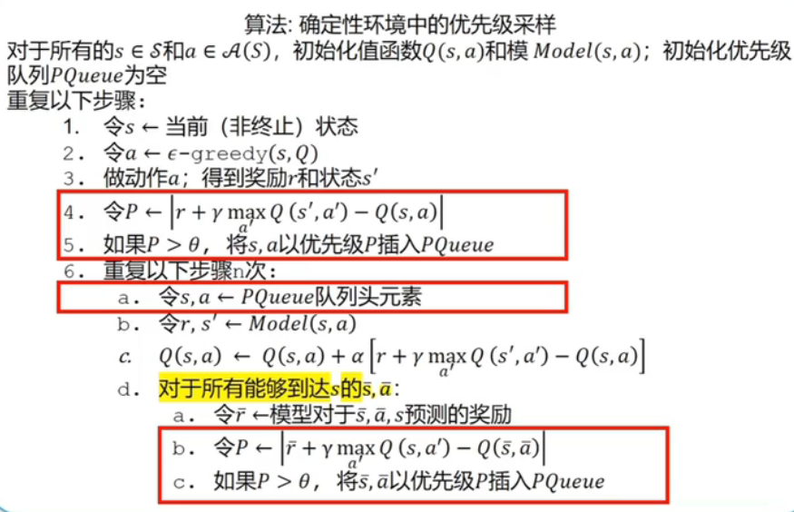
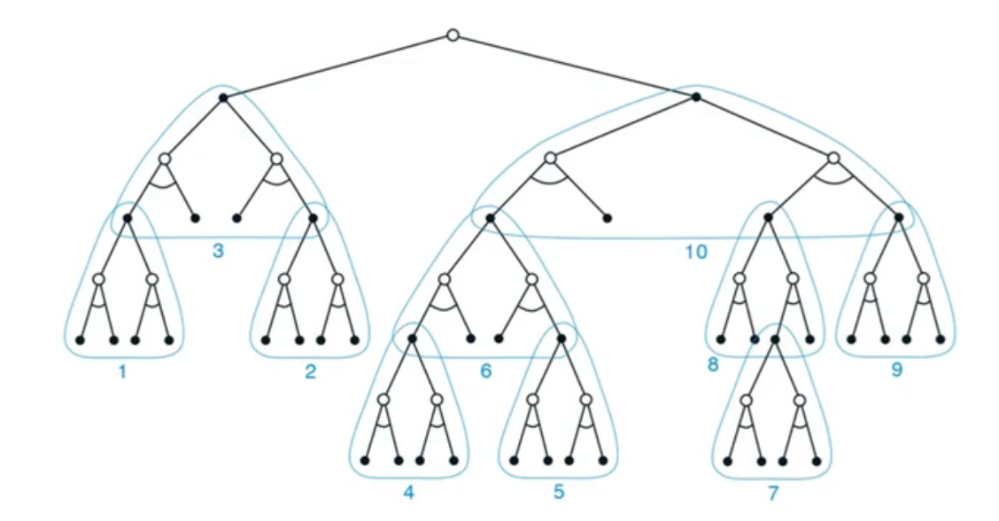
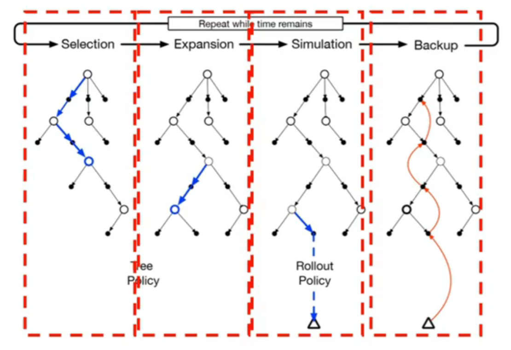

# Planning and Learning

## 1 Basic Idea of Model

在 model-based RL 中，所谓模型都是指环境的模型而非策略的模型。

给定一个状态和动作，模型能够预测下一个状态和奖励的分布  $p(s',r|s,a)$

模型有以下分类：

- 分类模型（distribution model）：描述了轨迹的所有可能性及概率
- 样本模型（sample model）：根据概率进行采样，只产生一条可能的轨迹（类比GAN）

模型的作用是得到模拟的经验数据（simulated experience）

## 2 The Concept of Planing

所谓规划（planning）是指输入一个模型，输出一个策略的迭代过程。

规划有以下分类：

- 状态空间的规划（state-space planning）
  - 在状态空间搜索最佳策略
- 规划空间的规划（plan-space planning）
  - 在规划空间搜索最佳策略，包括遗传算法和偏序规则
  - 这种情况下，一个规划就是一个动作集合以及动作顺序的约束
  - 这时的状态就是一个规划，目标状态就是能完成任务的预测

规划的通用框架是：

- 通过模型采样得到模拟数据
- 利用模拟数据更新值函数从而改进策略

规划的好处是：

- 任何时间点都可以被打断或重定向
- 在复杂问题下，进行小而且增量式的时间步规划是很有效的

## 3 Relationship Between Planning and Learning

规划与学习的不同点在于：

- 规划过程利用的是模型产生的模拟经验
- 学习过程利用的是环境产生的真实经验

相同点在于：

- 通过回溯（back-up）更新值函数的估计
- 统一来看，学习的方法可以用在模拟经验上

## 4 Dyna-Q

在强化学习中，根据选择的学习方法不同，真实经验的作用也不同：

- 更新模型：
  - 间接强化学习（模型强化学习）
  - 对经验数据的需求少
- 更新值函数和策略
  - 直接强化学习（无模型强化学习）
  - 简单且不受偏差的影响

Dyna-Q 算法是对这两种模式的集成，是对直接学习算法和间接学习算法的一种综合。

Dyna 算法的框架有以下几个组成部分：

- 和环境交互产生真实经验
- 使用真实经验进行直接强化学习
- 使用真是经验构建环境模型并采样模拟经验
- 使用模拟经验进行间接强化学习

注意算法中的重复 $n$ 次并不是指 $n$ 步的Q-planning，而是指 $n$ 次单步的 Q-planning。这是因为如果使用模型向后进行连续多步的模拟往往会造成复合误差的问题，即模型与真实环境之间的偏差会在步长中不断积累。

算法中，模型的更新方式取决于环境和模型类型，**对于确定性环境，可以使用 copy 的模型**，**对于非确定性的环境，可以使用参数化的模型**，并使用相应的更新方式进行更新。

一种改进的 Dyna-Q 算法是 Dyna-Q+ 算法，它使用 $r+\mathcal{K}\sqrt{\tau}$ 代替原先的奖励，其中：

- $r$ 代表原来的奖励
- $\mathcal{K}$ 代表小的权重参数
- $\tau$ 表示某个状态多久未到达过了

## 5 采样方法

### 5.1 均匀采样

最基础的采样方式，易遭遇单步学习无效的情况。

### 5.2 后向聚焦（backward focusing）与优先级采样

优先级采样的核心是根据值函数改变幅度定义的优先级确定的优先级更新队列：
$$P\leftarrow\left|r+\gamma\max_{a'}Q(s',a')-Q(s,a)\right|$$

如此做，采样过程会更关注哪些会带来值函数更新的状态动作对，因此更可能规避无效的采样，使得模型能够使用更少量的数据完成优化。

### 5.3 期望更新与采样更新

#### 5.3.1 期望更新

  $$ Q(s,a)\leftarrow\sum_{s',r}\hat{p}(s',r|s,a) [r+\gamma\max_{a'}Q(s',a')]$$

- 只适用于分布模型
- 需要更大的计算量
- 无偏估计

#### 5.3.2 采样更新

  $$Q(s,a)\leftarrow Q(s,a)+\alpha[r+\gamma max_{a'}Q(s',a')-Q(s,a)]$$

- 只需要采样模型
- 计算需求更低
- 受采样误差（sampling error）影响

## 6 决策时规划

决策时规划与背景规划的区别是：

- 实时的轨迹采样
- 只更新轨迹访问的状态值
- 只着眼于当前状态的动作选择

优势是：

- 能够跳过与策略无关的状态
- 在解决状态集合规模大的问题上有优势
- 满足一定条件时可以确定严格收敛到最优策略

### 6.1 启发式搜索（Heuristic Search）

启发式搜索是一种利用启发式信息来指导搜索过程的人工智能技术，"启发式信息"指的是与具体问题相关的额外知识。

启发式信息通常以评估函数的形式出现，用来估计从当前状态到达目标状态的成本或距离。

往往启发式搜索的树结构构建得越深，决策效果越好。

### 6.2 Rollout Algorithm

在 rollout 过程中，通常会从当前节点开始，采取一种简单的策略（例如随机策略或基于某种简单评估函数的策略）来进行一系列的动作直到游戏结束。

Rollout 的结果用来估计从该节点开始的最佳可能结果。

Rollout 算法有以下加速方式：

- 多个处理器并行采样
- 轨迹截断，用存储的值估计代替回报
- 剔除不可能成为最佳动作的动作

Rollout 算法是 MCTS 的一个组件。

Rollout 的时间复杂度是：
$$Time=\sum_{tr=1}^N\sum_{t=1}^K\left[\sum_{a=1}^AT_{eval}(S(T),a)+T_{choose}(A)\right]$$

其中：

- $A$：决策的动作空间
- $K$：一个轨迹的平均步数
- $T_{eval}(S(t),a)$：在第 $s$ 步下，估计 $(s,a)$ 值函数的时间
- $T_{choose}(A)$：每步做出决策的时间
- $N$：rollout 轨迹的次数

### 6.3 树策略（Tree Policy）

Tree policy 是指用于在搜索树中选择节点的一组规则或策略，主要目标是在已构建的部分搜索树中导航，以决定如何扩展树以及下一步探索哪个子节点。

Tree policy 包含两个关键步骤：

- **选择：** 从当前节点开始，依据某种准则递归地选择子节点进行探索，直到找到一个未完全展开的节点。
- **扩展：** 一旦确定了要扩展的节点，就会根据游戏规则或者环境动态添加一个或多个子节点到搜索树中，从而增加树的广度和深度，以便后续探索。

### 6.4 蒙特卡洛树搜索（Monte Carlo Tree Searcn）

MCTS是一种用于决策制定的启发式搜索算法，尤其适用于具有大量可能状态的游戏或问题，比如围棋、象棋等。它通过构建一个部分游戏树来探索可能性，并使用随机模拟（通常是rollout）来估计每个动作的价值。

MCTS 通常包含以下程序：

- **选择（Selection）：** 从根节点开始，根据tree policy选择一个节点，直到到达一个未完全展开的节点。
- **扩展（Expansion）：** 从未完全展开的节点中选择一个新节点加入到树中。
- **模拟（Simulation）：** 从新添加的子节点开始一轮或多轮的随机模拟，直到终止条件达成。
- **回溯（Backup）：** 根据模拟的结果更新路径上所有节点的相关统计结果，如获胜次数和访问次数。
