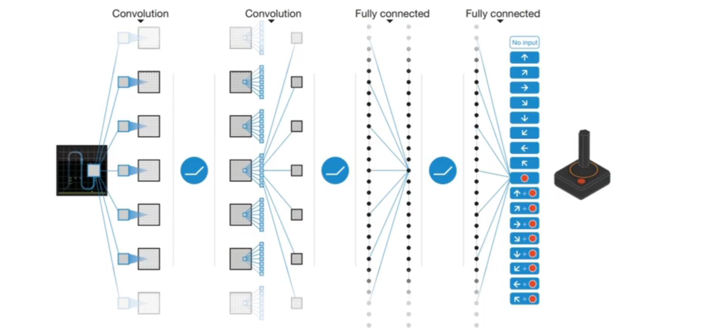

# Parameterized Value Functions and Policies

此前所涉及的所有情景均建立在值函数和策略有限离散的前提下。

## 1 参数化值函数近似

对于大规模 MDP 过程，解决办法是：

- 对状态函数进行离散化/分桶
- 构建参数化的值函数估计

### 1.1 对状态/动作进行离散化

对于连续状态的 MDP，我们可以对状态空间进行离散化：

- 例如，对于使用 $2$ 维连续值 $(s_1,s_2)$ 表示的状态，可以使用网格对状态空间进行切分，从而转化为离散的状态值
- 记离散的状态值为 $\bar{s}$
- 离散化的 MDP 可以表示为：$(\bar{S},A,\{P_{\bar{s}a},\gamma,R\})$
- 这样一来，就能够使用前述方法求解 MDP 过程

对于一个大型的离散状态 MDP，我们可以对状态值进一步分桶以进行采样聚合

分桶可以均匀地进行，也可以依赖一些启发式信息进行非均匀或层次化地进行。

离散化/分桶的优点是：

- 操作简洁直观
- 高效
- 在处理许多问题时能够达到较好的效果

缺点是：

- 过于简单的表示价值函数 $V$
- 可能为每个离散区间假设一个常数值
- 维度灾难：$S=R^N\Rightarrow \bar{S}=\{1,\dotsb,k\}^n$

### 1.2 参数化值函数近似

#### 1.2.1 参数化值函数的概念

$$V_\theta(s)\simeq V^\pi(s)$$

$$Q_\theta(s,a)\simeq Q^\pi(s,a)$$

其中：

- $\theta$ 是近似函数参数，可以通过强化学习进行更新
- 参数化的方法将可见状态泛化至没有见过的状态

常见的参数化值函数近似包括：

- 一般的线性模型（可微）
- 神经网络（可微）
- 决策树
- K 近邻
- 傅里叶/小波基底

#### 1.2.2 基于随机梯度下降（SGD）的值函数近似

**目标：** 找到参数向量 $\theta$ 最小化值函数近似值和真实值之间的均方误差
$$\mathcal{J}(\theta)=\mathbb{E}_\pi[\frac{1}{2}(V^\pi(s)-V_\theta(s))^2]$$

**优化方式：**  单次采样进行随机梯度下降
$$-\frac{\partial\mathcal{J}(\theta)}{\partial\theta}=\mathbb{E}_\pi[(V^\pi(s)-V_\theta(s))\frac{\partial V_\theta(s)}{\partial\theta}]$$

$$\begin{aligned}
    \theta&\leftarrow\theta-\alpha\frac{\partial \mathcal{J}(\theta)}{\partial \theta}\\
    &=\theta+\alpha(V^\pi(s)-V_\theta(s))\frac{\partial V_\theta(s)}{\partial \theta}
\end{aligned}$$

#### 1.2.3 特征化状态

使用一个特征向量表示状态：
$$x(s)=\begin{bmatrix}
    x_1(s)\\ \vdots \\ x_k(s)\\
\end{bmatrix}$$

例如，要表示一个在 3 维空间中的物体的运动状态，可以使用一个 9 维的向量：

- 空间坐标
- 速度矢量
- 加速度矢量

### 1.3 价值函数近似算法

#### 1.3.1 线性状态值函数近似

线性状态函数近似使用特征的线性组合表示价值函数：
$$V_\theta(s)=\theta^\top x(s)$$

目标函数是参数 $\theta$ 的二次函数
$$\mathcal{J}(\theta)=\mathbb{E}_\pi\left[\frac{1}{2}(V^\pi(s)-\theta^\top x(s))^2\right]$$

随机梯度下降可以收敛至全局最优解
$$\begin{aligned}
    \theta&\leftarrow\theta-\alpha\frac{\partial \mathcal{J}(\theta)}{\partial \theta}\\
    &=\theta+\alpha(V^\pi(s)-V_\theta(s))x(s)
\end{aligned}$$

那么现在关键的问题是如何近似取得公式中的 $V^\pi(s)$ 一项，可以利用蒙特卡洛近似、时序差分近似等方法。

#### 1.3.2 蒙特卡洛状态值函数近似

$$\theta\leftarrow\theta+\alpha(V^\pi(s)-V_\theta(s))x(s)$$

- $V^\pi(s)$ 表示真实的目标价值函数
- 在训练数据上运用监督学习对价值函数进行预测：
  $$\langle s_1,g_1\rangle\langle s_2,g_2\rangle\dotsb\langle s_T,g_T\rangle$$
- 对于每个数据样本 $\langle s_t,g_t\rangle$：
  $$\begin{aligned}
        \theta&\leftarrow\theta-\alpha\frac{\partial \mathcal{J}(\theta)}{\partial \theta}\\
        &=\theta+\alpha(g_t-V_\theta(s))\frac{\partial V_\theta(s)}{\partial \theta}
    \end{aligned}$$
- 蒙特卡洛近似至少能收敛到一个局部最优解，在价值函数为线性的情况下可以收敛至全局最优解

#### 1.3.3 时序差分状态值函数近似

- 时序差分算法的目标 $r_{t}+\gamma V_\theta(s_{t+1})$ 是对真实目标价值的有偏采样
- 在训练数据上运用监督学习对价值函数进行预测：
  $$\langle s_1,r_{1}+\gamma V_\theta(s_{2})\rangle\langle s_2,r_{2}+\gamma V_\theta(s_{3})\rangle\dotsb\langle s_T,r_{T}\rangle$$
- 对于每个数据样本 $\langle s_t,r_{t}+\gamma V_\theta(s_{t+1})\rangle$：
    $$\begin{aligned}
        \theta&\leftarrow\theta-\alpha\frac{\partial \mathcal{J}(\theta)}{\partial \theta}\\
        &=\theta+\alpha(r_t+\gamma V_\theta(s_{t+1})-V_\theta(s))\frac{\partial V_\theta(s)}{\partial \theta}
    \end{aligned}$$

- 在线性情况下近似收敛至全局最优解

#### 1.3.4 动作值函数近似

使用类似的梯度下降方法，同样可以对动作价值函数进行近似：
$$Q_\theta(s,a)\simeq Q^\pi(s,a)$$

优化目标同样是最小化均方误差：
$$\mathcal{J}(\theta)=\mathbb{E}_\pi\left[\frac{1}{2}(Q^\pi(s,a)-Q_\theta(s,a))^2\right]$$

同样使用类似的 SGD 算法在单个样本上更新：
$$\begin{aligned}
    \theta&\leftarrow\theta-\alpha\frac{\partial \mathcal{J}(\theta)}{\partial \theta}\\
    &=\theta+\alpha(Q^\pi(s,a)-Q_\theta(s,a))\frac{\partial Q_\theta(s,a)}{\partial \theta}
\end{aligned}$$

同样类似的，使用蒙特卡洛学习，更新方式是：
$$\theta\leftarrow\theta+\alpha(g_t-Q_\theta(s,a))\frac{\partial Q_\theta(s,a)}{\partial \theta}$$

对于时序差分学习，更新方式是：
$$\theta\leftarrow\theta+\alpha(r_t+\gamma Q_\theta(s_{t+1},a_{t+1})-Q_\theta(s,a))\frac{\partial Q_\theta(s,a)}{\partial \theta}$$

在参数化状态值函数或动作值函数的时序差分学习中，时序差分目标 $r_t+\gamma V_\theta(s_{t+1})$ 或 $r_t+\gamma Q_\theta(s_{t+1},a_{t+1})$ 部分虽然也与 $\theta$ 有关，但**在反向传播过程中，这一部分梯度是被丢弃的**。

#### 1.3.5 DQN（Deep Q Network）

DQN 是一种使用神经网络近似 Q 函数的经典算法。

在 DQN 中，由于 Q 函数的更新过程中涉及 $\max_a$ 这一操作，因此 DQN 一般只适用于离散动作的情况，在这种情况下，DQN 的神经网络接受一个状态 $s$ 作为输入，同时输出每一个状态的 $Q$ 值。

DQN 定义在第 $i$ 轮迭代中更新的 Q-学习损失函数
$$L_i(\theta_i)=\mathbb{E}_{(s,a,r,s')\sim U(D)}\left[\left(r+\gamma\max_{a'}Q(s',a';\theta_i^-)-Q(s,a;\theta_i)\right)\right]$$

- $\theta_i$ 是第 $i$ 轮迭代中将要更新的网络参数
- $\theta_i^-$ 是目标网络参数，可以认为是 $\theta_{i-1}$
- $(s,a,r,s')\sim U(D)$ 是指从经验池 $D$ 中均匀抽取样本，这样可以避免近期经验上过拟合

## 2 策略梯度

### 2.1 参数化策略

通过将策略参数化，可以将离散动作场景下的学习推广到连续动作场景中，同时使模型能够泛化到未知的状态上：
$$\pi_\theta(a|s)$$

参数化的策略可以是确定性的：
$$a=\pi_theta(s)$$

也可以是随机的：
$$\pi_\theta(a|s)=P(a|s;\theta)$$

### 2.2 基于策略的强化学习

优点：

- 更本质，更好的收敛性质
- 在高维度或连续的动作空间中更有效
- 能够学习随机策略

缺点：

- 通常会收敛至局部最优而非全局最优
- 策略评估通常比较低效，同时具有比较高的方差

### 2.3 单步 MDP 中的策略梯度

在一个起始状态分布为 $s\sim d(s)$ ，即时奖励为 $r_{sa}$ 的单步 MDP 过程中，策略的价值期望是：
$$\mathcal{J}(\theta)=\mathbb{E}_{\pi_\theta}[r]=\sum_{s\in S}d(s)\sum_{a\in A}\pi_\theta(a|s)r_{sa}$$

其对应的梯度是：
$$\frac{\partial \mathcal{J}(\theta)}{\partial \theta}=\sum_{s\in S}d(s)\sum_{a\in A}\frac{\partial\pi_\theta(a|s)}{\partial \theta}r_{sa}$$

根据似然比的性质：
$$\begin{aligned}
    \frac{\partial\pi_\theta(a|s)}{\partial \theta}&=\pi_\theta(a|s)\frac{1}{\pi_\theta(a|s)}\frac{\partial\pi_\theta(a|s)}{\partial\theta}\\
    &=\pi_\theta(a|s)\frac{\partial\log\pi_\theta(a|s)}{\partial\theta}
\end{aligned}$$

因此策略梯度可以写作：
$$\begin{aligned}
    \frac{\partial \mathcal{J}(\theta)}{\partial \theta}&=\sum_{s\in S}d(s)\sum_{a\in A}\frac{\partial\pi_\theta(a|s)}{\partial \theta}r_{sa}\\
    &=\sum_{s\in S}d(s)\sum_{a\in A}\pi_\theta(a|s)\frac{\partial\log\pi_\theta(a|s)}{\partial\theta}\\
    &=\mathbb{E}_{\pi_\theta}\left[\frac{\partial\log\pi_\theta(a|s)}{\partial\theta}r_{sa}\right]
\end{aligned}$$

这一结果可以通过从 $d(s)$ 中采样状态 $s$ 和从 $\pi$ 中采样 $a$ 近似估计。

这一结果可以被理解为模型的目的是增加高回报动作的对数似然，而减少低回报动作的对数似然，也就是所谓的“强化”过程。

### 2.4 策略梯度定理

策略梯度定理是单步 MDP 中策略梯度在多步 MDP 中的推广：

对于任意可微的策略 $\pi_\theta (a|s)$，任意策略的目标函数 $\mathcal{J}_1,\mathcal{J}_{avR},\mathcal{J}_{avV}$，其策略梯度是：
$$\frac{\partial \mathcal{J}(\theta)}{\partial \theta}=\mathbb{E}_{\pi_\theta}\left[\frac{\partial\log\pi_\theta(a|s)}{\partial\theta}Q^{\pi_\theta}(s,a)\right]$$

对于式中出现的 $Q^{\pi_\theta}(s,a)$ 可以使用 MC 或 TD 法进行估计。

### 2.4 蒙特卡洛策略梯度（REINFORCE）

在 REINFORCE 中，使用累计奖励值 $G_T$ 作为 $Q^{\pi_\theta}(s,a)$ 的无偏采样
$$\Delta\theta_t=\alpha\frac{\partial\log\pi_\theta(a|s)}{\partial\theta}g_t$$

由于使用了 MC 所以 REINFORCE 方法有较高的方差，解决方法是对每一次采样平行进行多次 rollout 然后取平均值：
$$\tilde{g}_t=\frac{1}{N}\sum_{i=1}^{n}g_t^{(i)}$$

需要对所有采样数据同时进行梯度下降计算，否则由于策略发生变化，未被使用的采样数据会失效。

### 2.5 Softmax 随机策略

$$\pi_\theta(a|s)=\frac{e^{f_\theta(s,a)}}{\sum_{a'}e^{f_\theta(s,a)}}$$

式中，$f_\theta(s,a)$ 是预定义的以 $\theta$ 为参数的状态-动作对分数函数。

该形式的策略梯度为：
$$\begin{aligned}
    \frac{\partial\log\pi_\theta(a|s)}{\partial\theta}&=\frac{\partial f_\theta(s,a)}{\partial\theta}-\frac{1}{\sum_{a'}e^{f_\theta(s,a)}}\sum_{a''}f_\theta(s,a'')\frac{\partial f_\theta(s,a'')}{\partial \theta}\\
    &=\frac{\partial f_\theta(s,a)}{\partial\theta}-\mathbb{E}_{a'\sim\pi_\theta(a'|s)}\left[\frac{\partial f_\theta(s,a')}{\partial\theta}\right]\\
\end{aligned}$$

$\frac{\partial f_\theta(s,a)}{\partial\theta}$ 是一个实际选择出的状态-动作的分数梯度，而 $\mathbb{E}_{a'\sim\pi_\theta(a'|s)}\left[\frac{\partial f_\theta(s,a')}{\partial\theta}\right]$ 是 softmax 策略下的状态-动作分数梯度的期望。

### 2.6 Actor-Critic 框架

Actor-Critic  模式提供了一种对 $Q^{\pi_\theta}(s,a)$ 进行估计的新方式，即直接建模一个可训练的值函数 $Q_\phi$ 。

在 Actor-Critic 框架，两个模型有不同的学习目标：

- **评论家（Critic）模型：**$Q_\phi(a,a)$
  $$Q_\phi(s,a)\simeq r(s,a)+\gamma \mathbb{E}_{s'\sim p(s'|s,a),a'\sim\pi_\theta(a'|s')}[Q_\phi(s',a')]$$
- **演员（Actor）模型：**$\pi_\theta(a|s)$
  $$\mathcal{J}(\theta)=\mathbb{E}_{s\sim P,\pi_\theta}[\pi_\theta(a|s)Q_\phi(s,a)]$$

  $$\frac{\partial \mathcal{J}(\theta)}{\partial \theta}=\mathbb{E}_{\pi_\theta}\left[\frac{\partial\log\pi_\theta(a|s)}{\partial\theta}Q^{\pi_\theta}(s,a)\right]$$

这两个模型的训练过程存在一定的对抗博弈的性质。

**Advantageous Actor-Critic（A2C）模式**是对经典 AC 模式的改进，通过以打分函数减去一个基线函数构建优势函数（advantageous function）对评论家的打分进行标准化，提供更多信息指导并降低方差：
$$A^\pi(s,a)=Q^\pi(s,a)-V^\pi(s)$$

由于：

$$\begin{aligned}
    Q^\pi(s,a)&=r(s,a)+\gamma\mathbb{E}_{s'\sim p(s'|s,a),a'\sim\pi_\theta(a'|s')}[Q_\phi(s'|a')]\\
    &=r(s,a)+\gamma\mathbb{E}_{s'\sim p(s'|s,a)}[V^\pi(s'|a')]
\end{aligned}$$

因此：

$$\begin{aligned}
    A^\pi(s,a)&=Q^\pi(s,a)-V^\pi(s)\\
    &=r(s,a)+\gamma\mathbb{E}_{s'\sim p(a'|s,a)}[V^\pi(s')-V^\pi(s)]\\
    &\simeq r(s,a)+\gamma[V^\pi(s')-V^\pi(s)]
\end{aligned}$$

**即我们只需要拟合状态值函数来拟合优势函数。**
