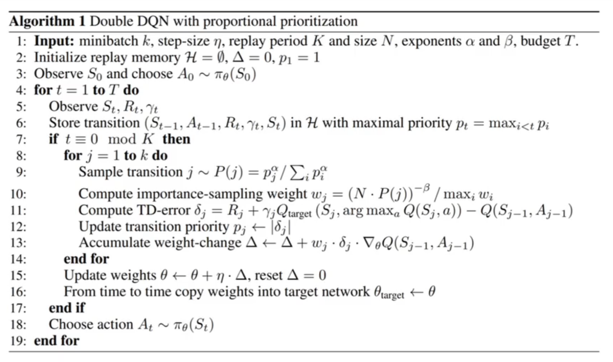
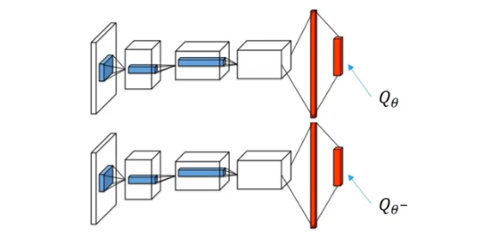
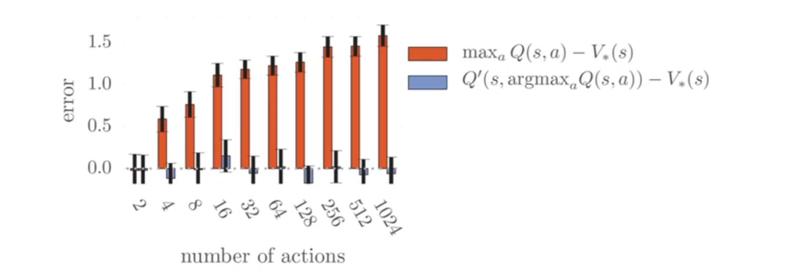
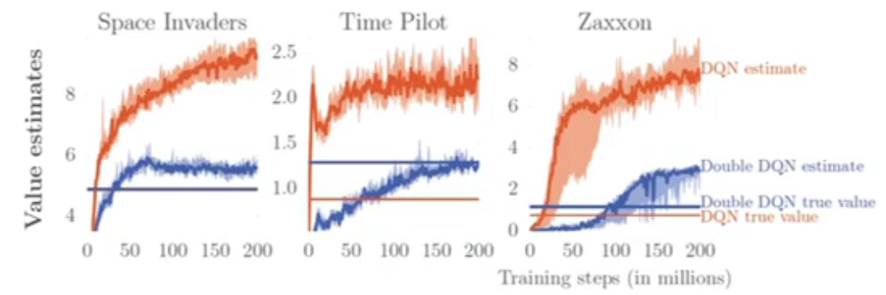
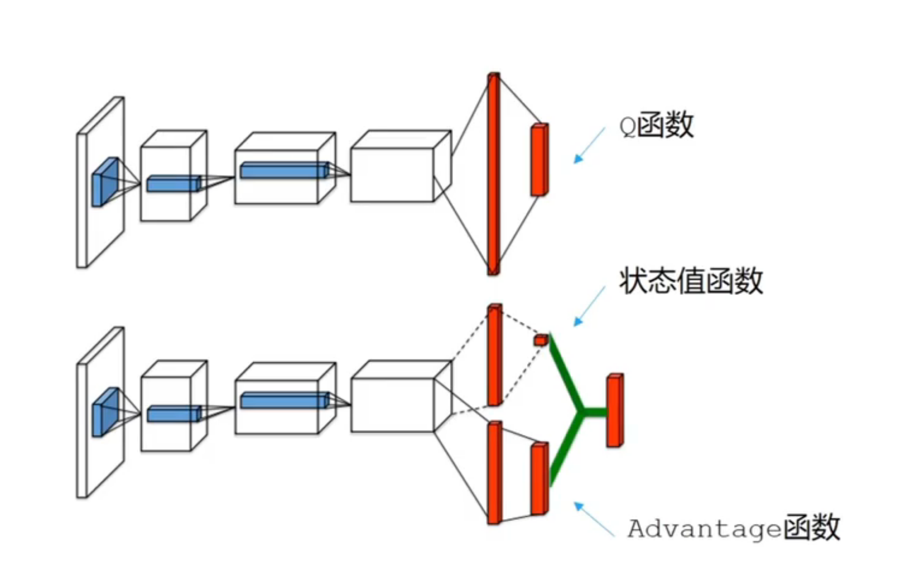
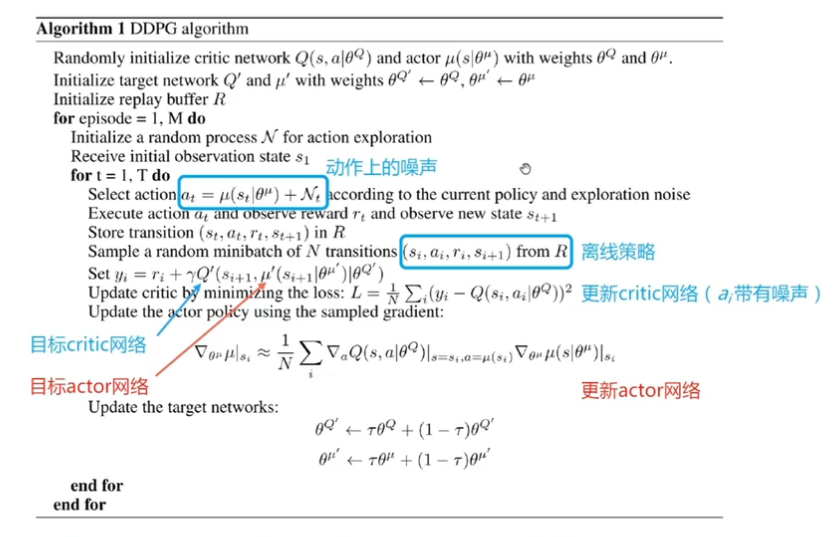
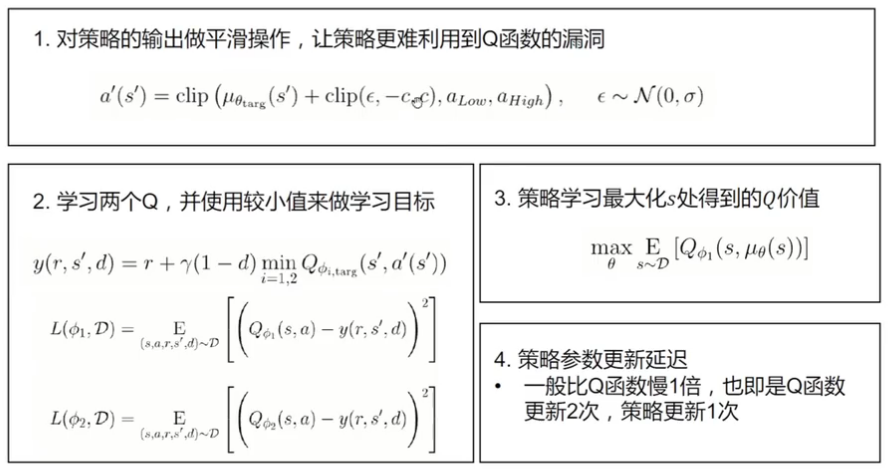

# Value Based Methods for Deep RL

## 1 Deep Q Net（DQN）

DQN 是一种基于价值函数的深度强化学习模型。模型学习一个以 $\theta$ 为参数的函数 $Q_\theta(s,a)$

- 目标值:
  $$y_t=r_t+\gamma\max_{a'}Q_\theta(s_{t+1},a')$$
- 更新方程:
  $$Q_\theta(s_t,a_t)\leftarrow Q_\theta(s_t,a_t)+\alpha(r+\gamma\max_{a'}Q_\theta(s_{t+1},a')-Q_\theta(s_t,a_t))$$
- 优化目标：
  $$\theta^*\leftarrow\arg\min_\theta\frac{1}{2N}\sum_{i=1}^N(Q_\theta(s_i,a_i)-(r_i+\gamma\max_{a'\in\mathcal{A}}Q_\theta(s'_i,a')))^2$$
  *：其中 $r+\gamma\max_{a'}Q_\theta(s_{t+1},a')$ 部分不参与梯度的计算。

由于更新过程中涉及 $\max_{a'}$ 的计算，因此这种模式只适用于有限离散动作空间的场景。

### 1.1 经验回放

在一般的监督学习中，我们假设数据是独立同分布的，每次训练神经网络时从训练数据中随机采样一个或若干个数据进行梯度下降，随学习的进行，每个数据会被使用多次。而在经典的 Q-learning算法中，每个数据只会用来更新一次 $Q$ 值。

为了更好地结合 Q-learning 与神经网络，DQN 算法采用了*经验回放*（experience replay）方法，建立一个回放缓冲区，将每次从数据库中采样得到的四元组数据 $e_t=\langle s_t,a_t,s_{t+1},r_t\rangle$ 存储于缓冲区 $D$ 中，再从 $D$ 中随机采样。

除了均匀采样之外，还可以进行优先级采样：

- 以 $Q$ 函数与 Target 值的差异来衡量学习的价值：
  $$p_t=|r_t+\gamma\max_{a'}Q_\theta(s_{t+1},a')-Q_\theta(s_t,a_t)|$$
  
  即 $Q$ 函数与 Target值的差异越大，学习的价值越大。
- 为了使所有样本均可能被采样，存储：
  $$e_t=\langle s_t,a_t,s_{t+1},r_t,p_t+\epsilon\rangle$$

- 样本 $e_t$ 被抽中的概率为：
  $$P(t)=\frac{p_t^\alpha}{\sum_{k=1}^N p^a_k}$$

- 重要性采样的权重为：
  $$\omega_j=\frac{(N\times P(j))^{-\beta}}{\max_i \omega_i}$$

使用经验回放的好处是：

- 使样本满足独立同分布假设，在 MDP 中交互直接产生的数据不满足独立同分布假设，这是因为这一时刻的状态与上一时刻的状态有关。
- 提高样本效率，每一个样本可以被使用多次，十分适合梯度学习。

### 1.2 目标网络·

DQN 算法更新的目标是让 $Q_\theta(s,a)$ 逼近 $r+\gamma\max_{a'}Q_{\theta}(s',a')$，由于时序差分误差目标本身就包含神经网络的输出，因此在更新网络参数时目标也在不断改变。这就很容易导致神经网络训练过程的不稳定。为此，DQN 使用了*目标网络*（terget network）的思想，利用两套独立的参数计算 TD 误差。

对于原有的损失函数：
$$\frac{1}{2}[Q_\theta(s,a)-(r+\gamma\max_{a'}Q_{\theta^-}(s',a'))]^2$$

- 原来的训练网络用于计算 $Q_\theta(s,a)$ 项，并且使用正常的梯度下降方法进行更新。
- 目标网络使用较旧的参数，记为 $\theta^-$，用于计算 $r+\gamma\max_{a'}Q_{\theta}(s',a')$ 项，每隔 $C$ 步和训练网络的参数同步一次。
$$L_i(\theta_i)=\mathbb{E}_{s_t,a_t,s_{t+1},r_t,p_t\sim D}\left[\frac{1}{2}\omega_t(r_t+\gamma\max_{a'}Q_{\theta_i}^-(s_{t+1},a')-Q_{\theta_i}(s_t,a_t))^2\right]$$

双网络模型的算法流程是：

- **收集数据：** 使用 ε-greedy 策略进行探索，将得到的 $\langle s_t,a_t,s_{t+1},r_t\rangle$ 放入经验池（reply-buffer）
- **采样：** 从数据库中采样得到 $k$ 个动作状态组
- **更新网路：**
  - 用采样得到的数据计算 $Loss$
  - 更新 $Q$ 函数网络参数 $\theta$
  - 每 $C$ 次迭代更新一次目标网络参数 $\theta^-$

## 2 Improvements for DQN

### 2.1 Double DQN

传统的 Q-learning 或 DQN 中存在 $Q$ 值过高估计（overestimation）的问题，传统 Q-learning 优化的 TD 误差目标为：
$$r+\gamma \max_{a'}Q_{\theta^-}(s',a')$$

其中，$\max_{a'}Q_{\theta^-}(s',a')$ 由目标参数计算得出，我们可以将其写成以下形式：
$$Q_{\theta^-}(s',\arg\max_{a'}Q_{\theta^-}(s',a'))$$

可以将 $\max$ 操作拆分为两部分，当两部分采用同一套 $Q$ 函数进行计算时，每次得到的都是神经网络当前估算的所有动作价值中的最大值，而由于神经网络估算的 $Q$ 值本身在某些时候会产生正相或负向的误差，因此在 DQN 的更新方式下神经网络会将正向误差累积。

 $Q$ 函数的过高估计会随着候选行动的数量增大而变得更加严重。

为了解决这一问题， Double DQN 算法提出利用两套独立训练的神经网络参数来估计 $\max_{a'}Q^*(s',a')$，具体的做法是将 $Q_{\theta^-}(s',\arg\max_{a'}Q_{\theta^-}(s',a'))$ 更改为 $Q_{\theta^-}(s',\arg\max_{a'}Q_{\theta}(s',a'))$，即使用一套神经网络 $Q_{\theta}$ 选取价值最大的动作，根据另一套神经网络 $Q_{\theta^-}$ 来估计该动作的价值。

由于在传统的 DQN 中本身就存在训练网络和目标网络两套神经网路，只不过 $max_{a'}Q_{\theta^-}(s',a')$ 的计算只是用目标网络，那么我们恰好可以直接使用训练网络作为其中的第一套网络选取动作，将目标网络作为第二套神经网络来计算 $Q$ 值。

因此可以写出 Double DQN 优化目标：
$$r+\gamma Q_{\theta^-}(a',\arg\max_{a'}Q_\theta(s',a'))$$

### 2.2 Dueling DQN

Dueling DQN 对经典 DQN 做出的改进类似于 A2C 框架对经典 AC 框架做出的改进。

Dueling DQN 框架中定义 advantage 函数：
$$A^\pi(s,a)=Q^\pi(s,a)-V^\pi(s,a)$$

在同一个状态之下，所有动作的优势值之和为 0，因为所有动作的动作价值的期望就是这个状态的状态价值，因此，在 Dueling DQN 中，Q 网络被建模为：
$$Q_{\theta,\alpha,\beta}(s,a)=V_{\theta,\alpha}(s)+A_{\theta,\beta}(s,a)$$

其中：

- $V_{\theta,\alpha}(s)$：状态价值函数
- $A_{\theta,\beta}(s,a)$：该状态下采取不同动作的优势函数
- $Q_{\theta,\alpha,\beta}(s,a)$：状态-动作价值函数
- $\theta$：状态价值函数和优势函数共享的网络参数，一般在神经网络中用于提取特征的前几层
- $\alpha$：价值函数的参数
- $\beta$：优势函数的参数

$V$ 函数和 $A$ 函数可以通过不同方式进行聚合得到 $Q$ 函数：

这种模式的好处是：

- 使智能体更好地处理与动作关联较小的状态
- 更加频繁、准确地学习状态价值函数

Dueling DQN 存在对 $V$ 值和 $A$ 值建模不唯一的问题，为了解决这一问题，Dueling DQN 强制最优动作的优势函数实际输出为0：
$$Q_{\theta,\alpha,\beta}(s,a)=V_{\theta,\alpha}(s)+\max_{a'\in |A|}A_{\theta,\beta}(s,a)$$

或者使用平均操作代替最大化操作：
$$Q_{\theta,\alpha,\beta}(s,a)=V_{\theta,\alpha}(s)+\frac{1}{|A|}\sum_{a'}A_{\theta,\beta}(s,a)$$

事实证明，使用平均操作能使模型更加稳定。

## 3 确定性策略梯度方法

### 3.0 深度强化学习的分类

- 基于价值的方法：DQN 及其扩展
- 基于确定性策略的方法：DPG（确定性策略梯度）、DDPG、TD3
- 基于随机策略的方法：使用神经网络的策略梯度、自然策略梯度、TRPO（信任区域策略优化）、PPO（近端策略优化）、A3C

### 3.1 随机策略与确定性策略

- 随机策略：
  - 对于离散动作：
    $$\pi_\theta(a|s)=\frac{e^{Q_\theta(s,a)}}{\sum_{a'}e^{Q_\theta(s,a')}}$$
  
  - 对于连续动作：
    $$\pi_\theta(a|s)\propto e^{(a-\mu_{\theta}(s))^2}$$

- 确定性策略：
  - 对于离散动作：
    $$\pi_\theta(s)=\arg\max_aQ_\theta(s,a)$$
  - 对于连续动作：
    $$a=\pi_\theta(s)$$

对于离散动作的确定性策略是不可微的，因此通常会退化成使用一般的 TD 优化方法，而连续动作的确定性策略是可微的。

### 3.2 确定性策略梯度（DPG）

对于确定性策略的优化，可以建模一个可微的用于估计状态-动作价值的评论家（critic）模块：
$$Q^\omega(s,a)\simeq Q^\pi(s,a)$$

Critic 模块采用的损失函数是：
$$\mathcal{L}(\omega)=\mathbb{E}_{(s\sim \rho^\pi,a\sim\pi_\theta)}[(Q^\omega(s,a)-Q^\pi(s,a))^2]$$

有确定性策略梯度：
$$\mathcal{J}(\pi_\theta)=\mathbb{E}_{s\sim\rho^\pi}[Q^\omega(s,a)]=\mathbb{E}_{s\sim\rho^\pi}[Q^\omega(s,\pi(s))]$$

通过链式法则求导得到策略梯度：
$$\nabla_\theta\mathcal{J}(\pi_\theta)=\mathbb{E}_{s\sim\rho^\pi}[\nabla_\theta\pi_\theta(s)\nabla_aQ^\omega(s,a)|_{a=\pi_\theta(s)}]$$

### 3.3 深度确定性策略梯度（DDPG）

在实际应用中，DPG 使用的带有神经函数近似器的 AC 方法在面对有挑战性的问题时是不稳定的。

深度确定性策略梯度（DDPG）给出了在确定性策略梯度（DPG）基础上的解决方法：

- 经验重放
- 目标网络
- 在动作输入前批标准化 Q 网络
- 添加连续噪声

### 3.4 双价值策略函数延迟更新（Twin Delayed DDPG,TD3）

在 DPG 的优化中，也有可能出现类似 DQN 的 $Q$ 值过高估计的问题，TD3 提出了类似 Double DQN 的解决方案，即使用两套神经网络分别进行动作选择和评估：

